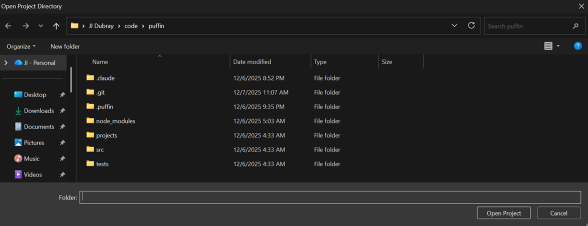
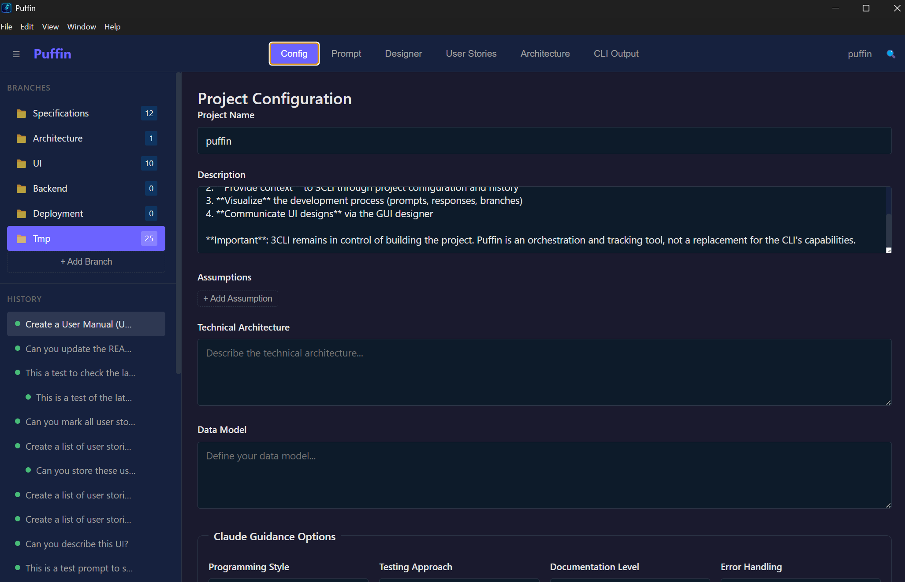
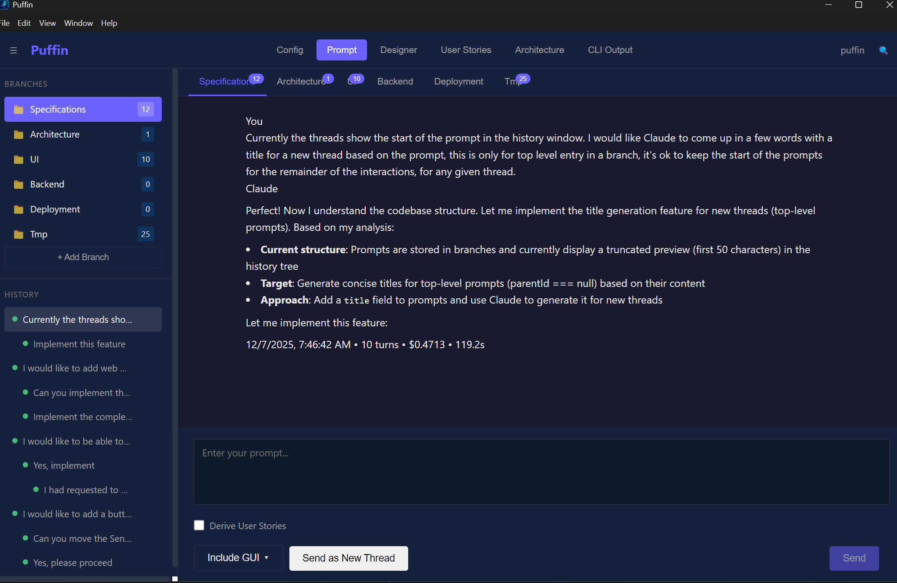
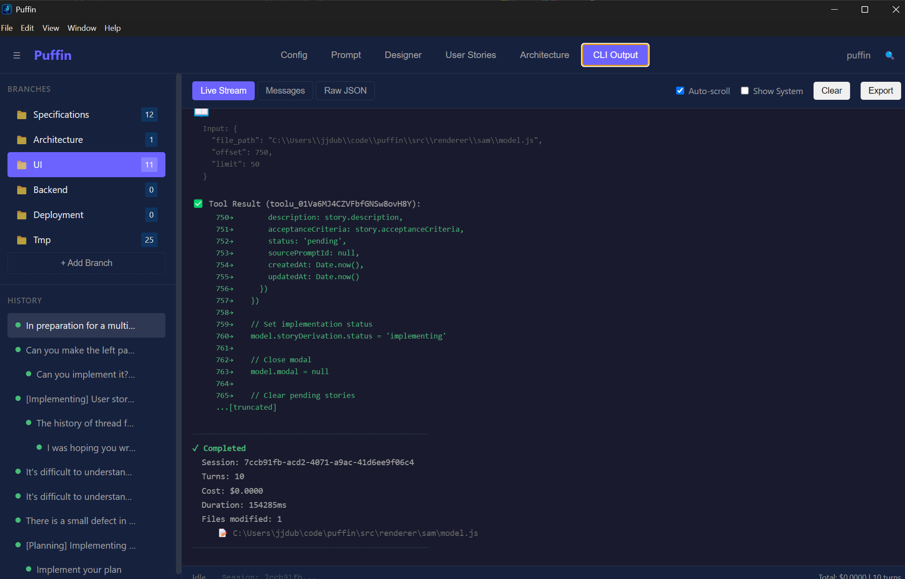

# Puffin User Manual

## Table of Contents
1. [Overview](#overview)
2. [Getting Started](#getting-started)
3. [Core Features](#core-features)
   - [Project Configuration](#project-configuration)
   - [Branched Conversation Management](#branched-conversation-management)
   - [Prompt Editor & Submission](#prompt-editor--submission)
   - [Real-Time Response Viewing](#real-time-response-viewing)
   - [GUI Designer](#gui-designer)
   - [Backlog Management](#backlog-management)
   - [AI-Powered Story Derivation](#ai-powered-story-derivation)
   - [Automated Sprint Implementation](#automated-sprint-implementation)
   - [Architecture Documentation](#architecture-documentation)
   - [Puffin Plugins](#puffin-plugins)
   - [Claude Code Plugins and Skills](#claude-code-plugins-and-skills)
   - [Calendar Plugin](#calendar-plugin)
   - [Toast History Plugin](#toast-history-plugin)
   - [Prompt Template Plugin](#prompt-template-plugin)
   - [Document Editor Plugin](#document-editor-plugin)
   - [Inline Prompt Markers](#inline-prompt-markers)
   - [Image Attachments for Prompts](#image-attachments-for-prompts)
   - [Sprint Close with Git Commit](#sprint-close-with-git-commit)
   - [Sprint Management Enhancements](#sprint-management-enhancements)
   - [CLI Output Monitoring](#cli-output-monitoring)
4. [User Interface](#user-interface)
5. [Workflows](#workflows)
6. [Advanced Features](#advanced-features)
7. [Troubleshooting](#troubleshooting)
8. [Appendix](#appendix)

---

## Overview

**Puffin** is an Electron-based GUI application that serves as a management layer on top of the Claude Code CLI (3CLI). It provides an organized, visual interface for AI-assisted software development projects.

### Key Benefits
- **Organize Conversations**: Structure prompts into topic-specific branches
- **Visual Design**: Create UI mockups that can be described to Claude
- **Project Context**: Maintain consistent project configuration and guidelines
- **Progress Tracking**: Monitor Claude's real-time tool execution and file modifications
- **Story Management**: Extract and manage user stories with AI assistance
- **Architecture Documentation**: Maintain living documentation with AI review

### How It Works
Puffin wraps the Claude Code CLI, providing structure and persistence while letting the CLI handle all the actual development work. All project state is stored in a `.puffin/` directory within your target project.


*Screenshot placeholder: Main application interface showing all key components*

---

## Getting Started

### Prerequisites
- **Claude Code CLI (3CLI)** must be installed and configured
- **Electron 33+** compatible system
- **Node.js v20 LTS** (required for SQLite/better-sqlite3 native module support)

### Installation
```bash
# Clone the repository
git clone https://github.com/your-org/puffin.git
cd puffin

# Install dependencies
npm install

# Run the application
npm start
```

#### Important: Windows/WSL Users

Puffin uses native Node.js modules (like `better-sqlite3`) that must be compiled for the correct platform. Since Puffin runs as a Windows Electron app, you **must run `npm install` from Windows** (PowerShell or CMD), not from WSL.

| Environment | Compiles For | Works with Electron? |
|-------------|--------------|---------------------|
| WSL `npm install` | Linux x64 | No |
| Windows `npm install` | Windows x64 | Yes |

If you accidentally ran `npm install` in WSL:
```powershell
# From Windows PowerShell or CMD
cd C:\Users\yourname\code\puffin
rm -r node_modules
npm install
```

The `postinstall` script will automatically run `electron-rebuild` to compile native modules for Electron.

### First Launch
1. Open Puffin
2. Select your target project directory
3. Puffin will create a `.puffin/` folder to store all project state
4. Configure your project settings in the Config view



---

## Core Features

### Project Configuration

Configure your project context and development preferences that will guide Claude throughout your development process.



#### Basic Information
- **Project Name**: Display name for your project
- **Description**: Brief overview of the project's purpose
- **Assumptions**: Key assumptions about the project (managed as a list)

#### Development Guidance
Configure how Claude approaches your project:

**Programming Style Options:**
- **Object-Oriented Programming (OOP)**: Class-based architecture
- **Functional Programming**: Immutable data and pure functions
- **Temporal Logic (TLA+/SAM)**: State machines and temporal reasoning
- **Hybrid**: Combines multiple paradigms as appropriate

**Testing Approach:**
- **Test-Driven Development (TDD)**: Write tests first
- **Behavior-Driven Development (BDD)**: Focus on user behavior
- **Integration First**: Prioritize integration testing

**Documentation Level:**
- **Minimal**: Essential documentation only
- **Standard**: Standard inline docs and README
- **Comprehensive**: Extensive documentation and examples

**Error Handling:**
- **Exceptions**: Traditional try/catch patterns
- **Result Types**: Explicit success/failure types
- **Either Monad**: Functional error handling

**Naming Convention:**
- **camelCase**: JavaScript standard
- **snake_case**: Python/database style
- **PascalCase**: Class names and components

**Comment Style:**
- **JSDoc**: Structured documentation comments
- **Inline**: Brief explanatory comments
- **Minimal**: Code should be self-documenting

#### UX/Design System
Configure your application's design language:


**Color Palette:**
- **Primary**: Main brand color (#6c63ff default)
- **Secondary**: Secondary accent (#16213e default)
- **Accent**: Success/highlight color (#48bb78 default)
- **Background**: Main background (#ffffff default)
- **Text**: Primary text color (#1a1a2e default)
- **Error**: Error/warning color (#f56565 default)

**Typography:**
- **Font Family**: System fonts or custom selection
- **Base Font Size**: 16px default, adjustable

**Auto-Generated Files:**
Configuration automatically generates a `CLAUDE.md` file in your project with all settings, which is included with every Claude prompt.

---

### Branched Conversation Management

Organize your development conversations into logical branches for better project management.


#### Default Branches
Puffin provides five protected branches that cannot be deleted:

1. **Specifications** 📋 - Project requirements and user stories
2. **Architecture** 🏗️ - System design decisions and technical architecture
3. **UI** 🎨 - User interface design and front-end development
4. **Backend** ⚙️ - API development and service implementation
5. **Deployment** 🚀 - Infrastructure and deployment processes

#### Custom Branches
- Create unlimited custom branches for specific features or topics
- Customize branch icons and names
- Each branch maintains its own conversation history
- Branch switching preserves conversation context

#### Conversation Features
- **Hierarchical Structure**: Prompts can be replies to other prompts
- **Prompt Counter**: See how many conversations exist per branch
- **Search & Navigation**: Find specific prompts across branches
- **Rerun Capability**: Re-execute previous prompts while maintaining session continuity

---

### Prompt Editor & Submission

Compose and submit prompts to Claude with enhanced context and options.



#### Core Features
- **Multi-line Text Editor**: Large textarea for prompt composition
- **Character Counter**: Real-time character count display
- **Branch Selection**: Choose which branch to submit the prompt to
- **New Thread Option**: Create a new branch from your prompt

#### Special Options

**Derive User Stories:**
- Checkbox option that automatically extracts user stories from specifications
- Triggers AI-powered story derivation workflow
- Perfect for requirements and specification responses

**Include GUI:**
- Dropdown to attach designed UI layouts to your prompt
- Integrates with the GUI Designer component
- Automatically formats visual designs into Claude-readable descriptions

#### Keyboard Shortcuts
- **Ctrl/Cmd + Enter**: Submit prompt
- **Escape**: Close prompt editor (when in modal mode)

#### Submission Process
1. Validate prompt content and branch selection
2. Generate unique prompt ID and timestamp
3. Add prompt to conversation history
4. Spawn Claude Code CLI subprocess with full context
5. Stream response in real-time

---

### Real-Time Response Viewing

Monitor Claude's responses and tool execution in real-time with complete transparency.


#### Response Display
- **Real-time Streaming**: See Claude's response as it's generated
- **Markdown Rendering**: Automatic formatting of code blocks, lists, and links
- **Streaming Indicator**: Visual cursor animation during active streaming
- **Response History**: Access to all previous responses in the conversation

#### Activity Tracking Panel
Monitor what Claude is doing in real-time:


**Current Tool Display:**
- Shows which tool Claude is currently executing
- Tool-specific emoji indicators (📖 Read, 📝 Write, ✏️ Edit, 💻 Bash, etc.)
- Real-time status updates

**File Operations:**
- **Currently Reading/Writing**: Files being actively processed
- **Recently Modified**: List of files changed during the session
- **Operation Types**: Read, Write, Edit, Execute tracking

**Status Indicators:**
- **Thinking**: Claude is reasoning about the problem
- **Tool-use**: Claude is executing tools (file operations, bash commands)
- **Complete**: Processing finished successfully

#### Response Metadata
Each response includes:
- **Cost**: Token usage and API cost
- **Duration**: Total execution time
- **Turn Count**: Number of back-and-forth exchanges
- **Tool Usage**: Summary of tools executed

---

### GUI Designer

Create visual UI layouts that can be described to Claude for implementation.


*Screenshot placeholder: Full designer interface with palette, canvas, and properties*

#### Element Palette
Drag elements from the palette onto the canvas:
- **Container**: Layout containers and wrappers
- **Text**: Headings, paragraphs, and labels
- **Input**: Text inputs, textareas, and form fields
- **Button**: Clickable buttons and actions
- **Image**: Images and media placeholders
- **List**: Lists and repeating content
- **Form**: Form containers and validation
- **Nav**: Navigation menus and links
- **Card**: Content cards and panels
- **Modal**: Overlays and dialog boxes

#### Canvas Features
- **Grid-based Layout**: 20px grid for precise positioning
- **Drag & Drop**: Intuitive element placement
- **Visual Selection**: Click to select elements
- **Resize Handles**: Drag to resize elements
- **Nested Elements**: Support for parent/child relationships
- **Visual Guidelines**: Grid lines and alignment aids

#### Property Inspector
Configure selected elements:


*Screenshot placeholder: Properties panel with form fields for element configuration*

- **Positioning**: X, Y coordinates and dimensions
- **Content**: Text content, placeholders, labels
- **Styling**: Colors, fonts, and visual properties
- **Behavior**: Click actions, form validation, etc.

#### Save & Export System
**Save as GUI Definition:**
- Named designs with descriptions
- Stored in `.puffin/gui-definitions/`
- Reusable across projects

**Export for Claude:**
- Converts visual design to structured text description
- Includes layout, elements, positioning, and properties
- Can be attached to prompts via "Include GUI" dropdown

#### Keyboard Shortcuts
- **Delete/Backspace**: Remove selected element
- **Click Canvas**: Deselect all elements

---

### Backlog Management

Create, organize, and track user stories with AI-powered derivation from specifications. The Backlog view provides a Kanban-style workflow for managing your project's user stories.


*Screenshot placeholder: Backlog list with filters and story cards*

#### Story Lifecycle
Stories progress through a four-state workflow:
- **Pending** 🟡: In the backlog, ready to be implemented
- **In Progress** 🟠: Currently being worked on by Claude
- **Completed** 🟢: Implementation finished
- **Archived** 📦: Completed stories older than 2 weeks (auto-archived on project open)

#### Story Properties
Each story contains:
- **ID**: Auto-generated unique identifier
- **Title**: Brief description of the story
- **Description**: Detailed explanation of requirements
- **Acceptance Criteria**: List of conditions for completion
- **Status**: Current lifecycle stage
- **Source**: Which branch/prompt the story originated from
- **Timestamps**: Created and last updated times

#### Story Operations

**Create Stories:**
- Manual creation via "+ Add Story" button
- AI derivation from specification responses (using "Derive User Stories" checkbox)

**Edit Stories:**
- Click the ✎ button to modify title, description, and acceptance criteria
- Click status badge to cycle through statuses

**Start Implementation:**
- Select one or more pending stories using checkboxes
- Click "Start Implementation" button in the action bar
- Puffin generates a detailed implementation prompt with planning instructions
- Stories are automatically marked as "In Progress"
- Prompt is submitted to Claude in the **current active branch** (not hardcoded to backend)
- Branch-specific context (UI guidelines, architecture docs, etc.) is injected into the prompt

**Acceptance Criteria Verification:**
When Claude implements stories, acceptance criteria are presented as a numbered list. Claude is required to verify each criterion at the end of implementation using status indicators:
- ✅ **Criterion N**: Explanation of how it was satisfied
- ⚠️ **Criterion N**: Partially implemented - what's done and what's missing
- ❌ **Criterion N**: Not implemented - explanation of blockers

This ensures nothing is overlooked and provides clear tracking of what was accomplished.

**Mark Complete:**
- Click the ✓ button on in-progress stories to mark them as completed
- Completed stories are moved out of the active workflow

**Reopen Stories:**
- Click the ↺ button on completed or archived stories to reopen them
- Reopened stories return to "Pending" status

**Archive Stories:**
- Click the ⌫ button on completed stories to manually archive them
- Archived stories are displayed in a collapsible section at the bottom
- Stories completed more than 2 weeks ago are auto-archived when the project opens

**Filter & Search:**
- Filter by status (All, Pending, In Progress, Completed, Archived)
- Filter by source branch
- Search by title or content

**Delete Stories:**
- Click the × button to remove stories
- Confirmation dialog prevents accidental deletion

---

### AI-Powered Story Derivation

Automatically extract user stories from specification documents using AI analysis.


*Screenshot placeholder: Three-step derivation workflow*

#### Three-Step Workflow

**Step 1: Derive Stories**
1. Check "Derive User Stories" when submitting specifications
2. After Claude responds with requirements, derivation automatically triggers
3. Claude API analyzes the specification text
4. Extracts structured user stories with titles, descriptions, and acceptance criteria

**Step 2: Review & Refine**


Review modal allows you to:
- **Mark as Ready**: Approve stories for implementation
- **Edit Properties**: Modify title, description, acceptance criteria
- **Delete Unwanted**: Remove irrelevant or duplicate stories
- **Request Changes**: Ask Claude to revise based on your feedback

**Step 3: Add to Backlog**
- Mark stories as ready by clicking the checkbox
- Click "Add to Backlog" to add approved stories
- Stories appear in the Backlog view with "Pending" status
- Original prompt is recorded in branch history

#### Refinement Loop
If stories need changes:
1. Provide feedback about what should be modified
2. Click "Request Changes"
3. Claude revises the stories based on your input
4. Review the updated stories
5. Repeat until satisfied

---

### Automated Sprint Implementation

Let Claude orchestrate entire sprints autonomously, implementing all stories in sequence with built-in code review and bug fixing.


#### Implementation Mode Selection

After approving a sprint plan, choose how implementation proceeds:

**Automated Mode** 🤖
- Claude orchestrates the entire sprint without intervention
- Stories are implemented in optimal order
- Automatic acceptance criteria validation
- Code review and bug fix phases included
- Best for well-defined sprints with clear requirements

**Human-Controlled Mode** 👤
- Traditional story-by-story implementation
- You control when each story starts
- Manual review between stories
- Best for exploratory or complex work

#### Orchestration Plan Review

Before automated implementation starts, review the orchestration plan:


**Plan Contents:**
- **Implementation Order**: Stories sequenced by dependencies and complexity
- **Branch Assignments**: Each story assigned to UI, Backend, Fullstack, or Plugin
- **Dependency Analysis**: Visual representation of story dependencies
- **Estimated Workflow**: Phases from implementation through review

**Branch Types:**
| Branch | Description |
|--------|-------------|
| **UI** | Visual components, styling, frontend-only changes |
| **Backend** | APIs, business logic, database changes |
| **Fullstack** | Stories requiring both UI and backend changes |
| **Plugin** | Extensions to the plugin system |

#### Implementation Phase

During automated implementation:

**Sequential Sessions:**
- Each story runs in a separate Claude session
- Clean context prevents cross-contamination
- Session isolation ensures focused implementation

**Progress Tracking:**
- Real-time status updates in the Sprint panel
- Current story highlighted with progress indicator
- Completed stories marked with checkmarks
- Cost and duration tracked per story

**Orchestration Controls:**
- **Pause** ⏸️: Temporarily halt implementation (resume later)
- **Stop** ⏹️: End automated mode (switch to human-controlled)
- Controls always visible during automation

#### Acceptance Criteria Validation

After each story implementation, Claude validates acceptance criteria:

**Validation Process:**
1. Claude reviews the implementation against each criterion
2. Each criterion is marked: ✅ Pass, ⚠️ Partial, ❌ Fail
3. Results are recorded in the story's progress
4. Failed criteria are flagged for review phase

**Automatic Progression:**
- Stories with all criteria passing continue to next story
- Partial or failed criteria are noted but don't block progress
- All issues addressed in the code review phase

#### Code Review Phase

After all stories are implemented, an automated code review runs:


**Review Focus:**
- Code quality and consistency
- Potential bugs or edge cases
- Security considerations
- Performance concerns
- Adherence to project patterns

**Findings:**
- Each issue is logged with file location and description
- Severity levels: Critical, Warning, Info
- Findings are queued for the bug fix phase

#### Bug Fix Phase

Issues from code review are addressed in sequential sessions:

**Bug Fix Workflow:**
1. Each finding gets its own implementation session
2. Claude fixes the specific issue
3. Fix is validated before moving to next finding
4. Progress tracked in the Sprint panel

**Finding Status:**
- **Pending**: Waiting to be addressed
- **Fixing**: Currently being worked on
- **Fixed**: Successfully resolved
- **Won't Fix**: Intentionally skipped (with reason)

#### Sprint Completion Summary

When all phases complete, a summary is displayed:


**Statistics Included:**
- **Total Duration**: Time from start to completion
- **Total Cost**: API costs across all sessions
- **Stories Completed**: Count and success rate
- **Criteria Validation**: Pass/partial/fail breakdown
- **Code Review Findings**: Issues found and fixed
- **Session Count**: Number of Claude sessions used

**Export Options:**
- Copy summary to clipboard
- Include in sprint close commit message
- Save to sprint history

#### Graceful Interruption

You maintain control throughout automated implementation:

**Pause Implementation:**
- Click Pause to temporarily stop
- Current story completes before pausing
- Resume continues from where you left off
- State is preserved across app restarts

**Stop Implementation:**
- Click Stop to end automated mode
- Transitions to human-controlled mode
- Completed stories remain completed
- Continue remaining stories manually

**Error Handling:**
- If a story fails, automation pauses
- Review the error and choose to retry or skip
- Option to switch to human-controlled mode

---

### Architecture Documentation

Maintain living architecture documentation with AI review and feedback.


*Screenshot placeholder: Markdown editor with architecture content and review panel*

#### Features
- **Markdown Editor**: Full-featured text editor for architecture content
- **Auto-save**: Changes automatically saved with debouncing
- **Word Count**: Track documentation length
- **Version Tracking**: Incremental version numbers on changes
- **Last Reviewed**: Timestamp of last AI review

#### Claude Integration
**Review with Claude:**
- Submit architecture documentation to Claude for analysis
- Receive feedback on clarity, completeness, and technical accuracy
- Get suggestions for improvements and missing sections
- Iterative refinement process

**Common Review Areas:**
- System component descriptions
- Data flow explanations
- Technology stack decisions
- Scalability considerations
- Security architecture
- Deployment architecture

#### Content Organization
Structure your architecture documentation with:
- **System Overview**: High-level description
- **Component Architecture**: Detailed component breakdown
- **Data Architecture**: Database and data flow design
- **API Architecture**: Interface specifications
- **Deployment Architecture**: Infrastructure and deployment
- **Security Architecture**: Security measures and considerations

---

### Puffin Plugins

Puffin features a modular plugin architecture that extends its core functionality. Plugins add new views, commands, and capabilities to the application.

#### Built-in Plugins

Puffin ships with four built-in plugins that are automatically loaded on startup:

**1. Stats Dashboard** 📊
- **Purpose**: Track and visualize usage statistics across branches
- **Features**:
  - Weekly statistics overview
  - Export statistics as markdown
  - Analytics dashboard view
- **Access**: Click "Stats" in the navigation bar

**2. GUI Designer** 🎨
- **Purpose**: Visual GUI definition designer for creating and managing UI layouts
- **Features**:
  - Drag-and-drop element placement
  - Save and load design templates
  - Export designs for Claude implementation
- **Access**: Click "Designer" in the navigation bar

**3. Claude Context** 📄
- **Purpose**: Manages CLAUDE.md configuration files for branch-specific Claude Code context
- **Features**:
  - View and edit CLAUDE.md content
  - Branch-specific context management
  - Propose and apply configuration changes
  - Branch focus management with edit capability
- **Access**: Click "Context" in the navigation bar

**4. Documents** 📁
- **Purpose**: Browse and preview documentation files from the docs/ directory
- **Features**:
  - Tree-based document navigation
  - Markdown file preview with syntax highlighting
  - Image file preview support
  - Quick document access
- **Access**: Click "Docs" in the navigation bar

**5. Calendar** 📅
- **Purpose**: Track development activity over time with a visual calendar view
- **Features**:
  - Week and month view toggle
  - Sprint history display for selected days
  - Git branch activity tracking
  - Post-it notes for annotations
  - Drag-and-drop note organization
- **Access**: Click "Calendar" in the navigation bar

**6. Toast History** 🔔
- **Purpose**: View and manage notification history
- **Features**:
  - 24-hour notification history
  - Copy notification content to clipboard
  - Delete old notifications
  - Type-based filtering (success, error, warning, info)
- **Access**: Click "Notifications" in the navigation bar

**7. Prompt Templates** 📝
- **Purpose**: Create and reuse prompt templates for Claude interactions
- **Features**:
  - Create, edit, and delete templates
  - Search templates by title or content
  - Copy template content to clipboard
  - Project-specific storage
- **Access**: Click "Templates" in the navigation bar

**8. Document Editor** 📝
- **Purpose**: Edit text files with syntax highlighting and AI assistance
- **Features**:
  - Edit code and text files directly within Puffin
  - Syntax highlighting for 190+ languages via highlight.js
  - Line numbers synchronized with scrolling
  - Auto-save with visual indicators
  - External file change detection
  - Recent files tracking
- **Access**: Click "Editor" in the navigation bar

**9. RLM Document Analysis** 🔍
- **Purpose**: Analyze large documents using the Recursive Language Model (RLM) approach
- **Credits**: Based on the RLM concept by [John Adeojo](https://github.com/brainqub3). Original Claude Code RLM skill: [brainqub3/claude_code_RLM](https://github.com/brainqub3/claude_code_RLM)
- **Features**:
  - Large document support through intelligent chunking
  - AI-powered iterative analysis using Claude Code CLI as sub-LLM
  - Automatic query refinement across multiple iterations
  - Synthesis of findings into coherent, well-structured answers
  - Interactive results tree with chunk inspection
  - Multiple query types: RLM Query (full analysis), Quick Query, Peek, Grep
  - Export results to JSON or Markdown
  - Session management with automatic cleanup
- **How RLM Works**:
  1. **Keyword Search**: Find chunks containing relevant keywords
  2. **Chunk Analysis**: Claude Code analyzes each chunk, extracting findings
  3. **Aggregation**: Deduplicate and rank findings by confidence
  4. **Synthesis**: Combine findings into a coherent answer
- **Requirements**: Python 3.7+ and Claude Code CLI must be installed
- **Access**: Click "RLM Documents" in the navigation bar

#### Plugin Architecture

Plugins in Puffin follow a consistent structure:
- **Main process component**: Handles backend logic and IPC handlers
- **Renderer component**: Provides UI views and user interaction
- **Manifest file**: Declares plugin metadata, views, commands, and activation events

Plugins can contribute:
- **Views**: New tabs in the navigation bar
- **Commands**: Actions accessible via menus or keyboard shortcuts
- **IPC Handlers**: Backend communication channels

---

### Claude Code Plugins and Skills

Beyond Puffin's internal plugin system, you can configure **Claude Code plugins** (also called "skills") that inject additional context into Claude's prompts. These skills enhance Claude's capabilities for specific tasks like frontend development, testing patterns, or architectural decisions.

#### How Claude Code Plugins Work

Claude Code plugins are stored in `.puffin/plugins/` within your project and inject skill content into the CLAUDE.md file when working on specific branches.

#### Plugin Structure

Each Claude Code plugin consists of:
```
.puffin/plugins/
└── frontend-design/
    ├── manifest.json    # Plugin metadata
    └── skill.md         # Skill content (injected into CLAUDE.md)
```

**manifest.json example:**
```json
{
  "name": "frontend-design",
  "version": "1.0.0",
  "displayName": "Frontend Design Skill",
  "description": "Distinctive, production-grade frontend interfaces",
  "author": "Anthropic",
  "skillFile": "skill.md",
  "tags": ["ui", "frontend", "design"],
  "enabled": true
}
```

#### Branch Assignment

Plugins can be assigned to specific branches so their skill content is automatically included when working on that branch:

- **UI Branch**: Frontend design skills, accessibility guidelines
- **Backend Branch**: API patterns, testing patterns
- **Specifications Branch**: Requirements writing guidelines

This allows Claude to receive contextually-relevant guidance based on the type of work being done.

#### Creating Custom Skills

You can create your own Claude Code plugins by:
1. Creating a directory in `.puffin/plugins/`
2. Adding a `manifest.json` with plugin metadata
3. Adding a `skill.md` with the skill content (markdown format)
4. Enabling the plugin in your configuration

---

### Calendar Plugin

Track your development activity over time with an interactive calendar view that integrates sprints, git history, and personal notes.


#### Week and Month View Toggle

Switch between different time perspectives to see your work at various scales:

- **Week View**: Shows 7 days with detailed daily information
- **Month View**: Shows the full month grid with compact indicators
- **Auto-responsive**: Automatically switches based on screen width (1200px breakpoint)
- **Persistent Preference**: Your view choice is remembered across sessions

#### Sprint History Panel

Click any calendar day to see sprint activity in a left panel:

- **Archived Sprints**: Sprints closed on that date
- **Active Sprints**: Sprints that were active during that date
- **Activity Indicators**: Visual markers showing sprint progress
- **Collapsible Panel**: Save screen space by collapsing the panel (state persists)
- **Sprint Details**: Click a sprint to open the sprint modal with user stories

#### Git Branch History Display

See which git branches you worked on for each calendar day:

- **Branch Pills**: Colored indicators for each branch
- **Branch Popover**: Click to see full branch details
- **Activity Tracking**: Shows branches with commits on that date
- **Overflow Indicator**: "+N" badge when many branches are present

#### Post-it Notes for Calendar Days

Attach personal notes and reminders to any calendar day:


**Creating Notes:**
- Click the "+" button on any day cell
- Enter your note text
- Choose from 6 colors: yellow, pink, blue, green, orange, purple
- Notes display with a handwriting-style appearance

**Managing Notes:**
- **Edit**: Click a note to modify its content or color
- **Delete**: Use the delete button in the note editor
- **Limit**: Up to 10 notes per day with overflow indicator

#### Drag and Drop Notes Between Days

Quickly reorganize your notes by dragging them to different days:

1. Click and hold a post-it note
2. Drag to the target day
3. Release to move the note
4. Visual feedback shows valid drop targets

#### Copy and Paste Notes

Duplicate notes across multiple days:

- **Copy**: `Ctrl+C` (or `Cmd+C` on Mac) while a note is selected
- **Paste**: `Ctrl+V` (or `Cmd+V`) on the target day
- Preserves note content and color
- Visual feedback confirms copy/paste operations

---

### Toast History Plugin

View and manage your notification history with the Toast History plugin.


#### Notification Tracking

All toast notifications in Puffin are automatically logged:

- **Success** ✓: Operation completed successfully (green)
- **Error** ✗: Something went wrong (red)
- **Warning** ⚠: Attention needed (orange)
- **Info** ℹ: General information (blue)

#### 24-Hour History View

Notifications are organized into two sections:

- **Last 24 Hours**: Recent notifications with full details
- **Older**: Notifications older than 24 hours (collapsible)

#### Managing Notifications

**Copy to Clipboard:**
- Click the 📋 button on any notification
- Copies formatted text: `[TYPE] TIMESTAMP\nMESSAGE`
- Visual checkmark confirms successful copy

**Delete Old Notifications:**
- Click 🗑 on individual old notifications
- Use "Delete All" to remove all notifications older than 24 hours
- Confirmation dialog prevents accidental deletion

**Refresh:**
- Click the ↻ button to reload notification history
- Useful after background operations

---

### Prompt Template Plugin

Create, manage, and reuse prompt templates for faster Claude interactions.


#### Creating Templates

Save frequently-used prompts as reusable templates:

1. Click the "Templates" tab in the navigation bar
2. Click "Create New" button
3. Enter a title and the prompt content
4. Click "Save" to store the template

**Template Properties:**
- **Title**: Descriptive name for quick identification
- **Content**: The full prompt text
- **Last Edited**: Automatically tracked timestamp

#### Managing Templates

**Search Templates:**
- Use the search input to filter by title or content
- Results update as you type
- Clear search to show all templates

**Edit Templates:**
- Click the ✏️ edit icon on any template
- Modify title or content
- Save changes or cancel

**Delete Templates:**
- Click the 🗑 delete icon
- Confirmation prevents accidental deletion

**Copy to Clipboard:**
- Click the 📋 copy icon to copy template content
- Paste directly into the prompt editor
- Visual feedback confirms successful copy

#### Default Templates

The plugin includes starter templates for common use cases:

- Code review requests
- Bug fix descriptions
- Feature implementation prompts
- Documentation generation

#### Storage

Templates are stored in `.puffin/prompt-templates.json` within your project directory, making them:
- Project-specific (different templates per project)
- Version-controllable (can be committed to git)
- Portable (move with your project)

---

### Document Editor Plugin

Edit text files directly within Puffin with syntax highlighting, auto-save, and AI assistance capabilities.


#### Supported File Types

The Document Editor supports a wide range of text file formats:

**Code Files:**
- JavaScript/TypeScript: `.js`, `.ts`, `.jsx`, `.tsx`
- Web: `.html`, `.css`, `.scss`
- Python: `.py`
- Ruby: `.rb`
- Go: `.go`
- Rust: `.rs`
- Java: `.java`
- C/C++: `.c`, `.cpp`, `.h`
- Shell: `.sh`, `.bash`, `.zsh`, `.ps1`, `.bat`

**Data Files:**
- JSON: `.json`
- YAML: `.yaml`, `.yml`
- XML: `.xml`
- SQL: `.sql`
- GraphQL: `.graphql`

**Documentation:**
- Markdown: `.md`
- Plain Text: `.txt`

#### Opening Files

**Create New File:**
1. Click the "New" button in the toolbar
2. Choose a location and filename in the native save dialog
3. The file is created and opened for editing

**Open Existing File:**
1. Click the "Open" button in the toolbar
2. Select a file from the native file picker
3. File content loads with appropriate syntax highlighting

**Recent Files:**
- Recently opened files are tracked for quick access
- Up to 10 recent files are stored
- Click a recent file to reopen it instantly

#### Editor Features

**Syntax Highlighting:**
- Powered by highlight.js with 190+ language support
- Automatic language detection based on file extension
- Color-coded syntax for improved readability

**Line Numbers:**
- Line numbers displayed in a left gutter
- Synchronized scrolling with editor content
- Click line numbers for quick navigation

**Text Editing:**
- Standard text editing operations (undo, redo, select, copy, paste)
- Tab key inserts spaces (2 spaces by default)
- Cursor position preserved during updates

#### Auto-Save Functionality


**How Auto-Save Works:**
- Enabled by default
- Saves after 1.5 seconds of inactivity (debounced)
- Visual indicator shows save state

**Save States:**
| State | Indicator | Description |
|-------|-----------|-------------|
| Saved | Green dot | All changes saved to disk |
| Unsaved | Yellow dot | Changes pending |
| Saving | Spinner | Save in progress |
| Error | Red dot | Save failed (check permissions) |

**Toggle Auto-Save:**
- Use the checkbox in the toolbar to enable/disable
- When disabled, use the "Save" button for manual saves
- Preference is preserved for the session

#### External File Changes

The Document Editor watches for external modifications to the open file:

**Detection:**
- Uses file system watcher (`fs.watch`)
- Detects changes made by other editors or tools
- Notification appears when changes detected

**Handling Changes:**
- Prompt asks whether to reload the file
- Option to keep current content or reload from disk
- Prevents accidental overwrites of external changes

#### Layout Structure

The Document Editor tab includes four areas:

```
┌─────────────────────────────────────────────────────────┐
│ [New] [Open] [Save]  │  filename.js  │  ● Saved  │ [✓] │ <- Toolbar
├─────────────────────────────────────────────────────────┤
│  1 │ const foo = 'bar';                                │
│  2 │ function hello() {                                │
│  3 │   console.log('world');                           │ <- Editor Area
│  4 │ }                                                 │
├─────────────────────────────────────────────────────────┤
│ Ask AI about this document...                    [Ask] │ <- Prompt Input (future)
├─────────────────────────────────────────────────────────┤
│ AI responses will appear here                          │ <- Response Area (future)
└─────────────────────────────────────────────────────────┘
```

**Toolbar:**
- File operations (New, Open, Save)
- Current filename display
- Save status indicator
- Auto-save toggle

**Editor Area:**
- Line numbers gutter
- Syntax-highlighted code view
- Scrollable with synchronized line numbers

**Prompt Input (Future):**
- Text input for AI queries about the document
- Currently stubbed for future AI integration

**Response Area (Future):**
- Displays AI responses
- Currently stubbed for future AI integration

#### Empty State

When no file is open, the editor displays an empty state:

- "No Document Open" message
- Quick action buttons for "New Document" and "Open File"
- Provides clear guidance for getting started

#### Keyboard Shortcuts

| Shortcut | Action |
|----------|--------|
| `Tab` | Insert 2 spaces |
| `Ctrl+S` / `Cmd+S` | Manual save (when auto-save disabled) |
| `Ctrl+Z` / `Cmd+Z` | Undo |
| `Ctrl+Y` / `Cmd+Y` | Redo |
| `Ctrl+A` / `Cmd+A` | Select all |

#### Storage and Configuration

**File Storage:**
- Files are saved to their original location on disk
- Recent files list stored in plugin configuration
- UTF-8 encoding used for all files

**Plugin Files:**
```
plugins/document-editor-plugin/
├── puffin-plugin.json    # Plugin manifest
├── index.js              # Main process handlers
├── package.json          # Dependencies (highlight.js)
├── README.md             # Documentation
└── renderer/
    ├── components/       # View components
    └── styles/           # CSS styles
```

---

### Inline Prompt Markers

Embed Claude instructions directly within your document using inline prompt markers. This powerful feature allows you to place prompts exactly where you want changes to occur.


#### Marker Syntax

Puffin uses a distinctive marker syntax that works across all file types:

```
/@puffin: your instruction here @/
```

**Key characteristics:**
- **Universal format**: Works in any text file, regardless of programming language
- **Visually distinct**: Highlighted with a yellow background and 🐧 icon
- **Multiline support**: Instructions can span multiple lines

**Multiline example:**
```
/@puffin:
  Refactor this function to:
  1. Use async/await instead of callbacks
  2. Add error handling with try/catch
  3. Add JSDoc documentation
@/
```

#### How Markers Work

When you submit a document with markers, Claude:
1. **Reads the entire document** to understand context
2. **Finds all markers** in the document
3. **Processes instructions holistically** (not one-by-one)
4. **Applies changes** that satisfy all marker instructions
5. **Removes markers** as part of applying the edits

**Important:** Claude processes markers as a cohesive whole, understanding how instructions relate to each other. This means you can reference other parts of the document in your markers.

#### Inserting Markers

There are three ways to insert a marker:

**1. Toolbar Button:**
- Click the 🐧 **Insert Marker** button in the toolbar
- A marker is inserted at your cursor position
- Cursor is placed inside the marker for immediate typing

**2. Context Menu:**
- Right-click in the editor
- Select **"Insert Puffin Marker"** (or **"Wrap Selection with Puffin Marker"** if text is selected)
- The marker is inserted at your cursor

**3. Keyboard Shortcut:**
- Press **Ctrl+M** (or **Cmd+M** on Mac)
- Quickly insert a marker without leaving the keyboard

#### Wrapping Selected Text

If you select text before inserting a marker, the selection becomes the marker content:

1. Select the text you want to modify
2. Use any insertion method (toolbar, context menu, or Ctrl+M)
3. The selected text is wrapped: `/@puffin: selected text @/`

This is useful for quickly marking sections that need changes.

#### Visual Highlighting

Markers are visually distinct in the editor:

| Element | Appearance |
|---------|------------|
| **Background** | Yellow gradient with dashed border |
| **Icon** | 🐧 Puffin emoji prefix |
| **Hover** | Enhanced highlighting for visibility |

The highlighting ensures markers stand out from your code and don't get confused with regular comments.

#### Cleaning Markers

Remove all markers from your document with the **Clean Markers** button:

1. Click the 🧹 **Clean Markers** button in the toolbar
2. A confirmation dialog shows how many markers will be removed
3. Click **"Remove All Markers"** to clean the document

**What gets removed:**
- The entire marker syntax (`/@puffin: ... @/`)
- The prompt content inside the marker
- Surrounding document content is preserved

**When to clean markers:**
- After Claude has processed all your instructions
- Before committing code (markers are for development, not production)
- When you want to start fresh with new instructions

#### Best Practices

**Placement:**
- Place markers close to the code you want modified
- For file-wide changes, place marker at the top
- For function-specific changes, place marker above the function

**Instruction clarity:**
- Be specific about what you want changed
- Reference existing code by name (function names, variable names)
- Include examples if the desired output isn't obvious

**Multiple markers:**
- Use multiple markers for unrelated changes
- Keep related instructions in a single marker
- Claude processes all markers together, so they can reference each other

#### Marker Processing Flow

```
┌─────────────────────────────────────────────────────────────────┐
│  1. Write your document with embedded markers                   │
│     /@puffin: Add input validation @/                           │
│                                                                 │
│  2. Click "Send to Claude" button                               │
│     → Document + all markers sent to Claude                     │
│                                                                 │
│  3. Claude processes holistically                               │
│     → Understands full context                                  │
│     → Applies changes for ALL markers                           │
│     → Removes markers in the process                            │
│                                                                 │
│  4. Review changes in response panel                            │
│     → Accept, modify, or undo                                   │
│                                                                 │
│  5. Clean any remaining markers (if needed)                     │
│     → Click 🧹 Clean Markers                                    │
└─────────────────────────────────────────────────────────────────┘
```

#### Known Limitations

- The `@/` end delimiter is rarely used in code, reducing false matches
- The symmetric `/@...@/` pattern makes markers easy to spot
- Malformed markers (incomplete syntax) are ignored silently

#### Keyboard Shortcuts

| Shortcut | Action |
|----------|--------|
| `Ctrl+M` / `Cmd+M` | Insert marker at cursor |
| `Ctrl+M` with selection | Wrap selection with marker |

---

### Image Attachments for Prompts

Attach images to your prompts for visual context when communicating with Claude.


#### Drag and Drop Images

1. Drag image files from your file explorer
2. Drop them onto the prompt textarea
3. Visual drop zone indicator shows when dragging over
4. Multiple images can be dropped at once

**Supported Formats:** PNG, JPG, JPEG, WebP

#### Paste Images from Clipboard

1. Copy an image (screenshot, from browser, etc.)
2. Focus the prompt textarea
3. Press `Ctrl+V` (or `Cmd+V` on Mac)
4. Images are extracted and attached automatically

#### Image Preview and Management

**Thumbnail Gallery:**
- Attached images appear as 60×60px thumbnails below the prompt
- Filename displayed for identification
- Click thumbnail to view full-size preview

**Full-Size Preview:**
- Click any thumbnail to open large preview modal
- Filename displayed below image
- Click outside or press Escape to close

**Remove Images:**
- Click the × button on any thumbnail to remove it
- Removed images are deleted from temporary storage

#### Attachment Limits

- **Maximum 5 images** per prompt
- **Maximum 50MB** per image file
- Error message displayed if limits exceeded

#### How Images Are Sent to Claude

When you submit a prompt with images:
1. Images are saved to temporary storage (`.puffin/temp-images/`)
2. Image paths are included with the prompt
3. Claude receives the visual context with your text
4. Temporary files are cleaned up automatically after 24 hours

---

### Sprint Close with Git Commit

Optionally commit your code changes when closing a sprint for a clean development workflow.


#### Auto-Generated Commit Messages

When closing a sprint, Puffin automatically generates a conventional commit message:

**Format:**
```
feat(scope): complete "Sprint Title" (N/M stories)

Completed:
- Story 1 title
- Story 2 title

Incomplete:
- Story 3 title (if any)
```

**Scope Detection:**
- `ui`: Sprint focused on UI/frontend work
- `backend`: API and server-side work
- `test`: Testing-focused sprints
- `fix`: Bug fix sprints
- `sprint`: Generic scope for mixed work

#### Using the Commit Feature

1. **Click "Close Sprint"** on your active sprint
2. **Review the Summary**: See completed vs incomplete stories
3. **Enable Commit** (if git changes detected):
   - Check "Commit sprint changes"
   - Review the auto-generated message
   - Edit the message if needed
4. **Submit**: Sprint closes and git commit executes

#### Editing the Commit Message

- The commit message textarea shows the generated message
- Click to edit and customize as needed
- Your edits are preserved if you toggle the commit checkbox
- Use the copy button to copy the message to clipboard

#### Git Status Detection

The commit option only appears when:
- The project is a git repository
- There are uncommitted changes (staged, unstaged, or untracked)
- Git is available on the system

**Status Display:**
- Shows current branch name
- Displays count of changed files
- Indicates if working tree is clean

#### Error Handling

- Git errors don't prevent sprint closure
- If commit fails, sprint still closes successfully
- Warning toast notifies you of commit failure
- Full error details logged to console

---

### Sprint Management Enhancements

Enhanced sprint lifecycle management with options for incomplete and abandoned sprints.

#### Handling Zero-Progress Sprints

When closing a sprint with no completed work, Puffin offers specialized options:


**Detection:**
- Triggered when no stories are completed or in-progress
- Shows alert: "This sprint has no completed work"
- Displays: "0 of N stories completed, No implementation tasks started"

**Options:**

1. **Keep Active** 🔄
   - Sprint remains open for future work
   - No changes to story assignments
   - Toast confirms: "Sprint kept active"

2. **Delete** 🗑
   - Removes the sprint entirely
   - Stories return to pending pool
   - Sprint won't appear in history
   - Requires confirmation

#### Delete Sprint Confirmation

When deleting a sprint, a confirmation dialog ensures you understand the consequences:

- **Warning Icon**: Clear visual indicator
- **Impact List**:
  - "N user stories will return to pending pool"
  - "Sprint will NOT appear in history"
- **Irreversible**: "This action cannot be undone"
- **Safety Default**: Cancel button is focused

#### Stories Return to Pending Pool

When a sprint is deleted:
- All assigned stories return to "Pending" status
- Stories are immediately available for new sprints
- Story history and content preserved
- No data loss except sprint association

---

### CLI Output Monitoring

Transparent debugging and monitoring of Claude Code CLI interactions.



#### Three Output Views

**1. Live Stream Tab**
- Raw text output as it streams from Claude
- Real-time tool execution indicators
- Modified file tracking
- Auto-scroll option for following active output

**2. Messages Tab**
- Parsed message blocks organized by type
- **Assistant Messages**: Claude's responses and tool usage
- **User Messages**: Tool results and system responses
- **System Messages**: Internal CLI communications
- **Result Messages**: Final metadata (cost, tokens, session ID)

**3. Raw JSON Tab**
- Complete JSON output for debugging
- One line per message for easy parsing
- Copy-paste friendly format
- Useful for troubleshooting tool execution

#### Session Information
- **Session ID**: Unique identifier for conversation continuity
- **Total Cost**: Accumulated API costs for the session
- **Turn Count**: Number of back-and-forth exchanges
- **Execution Duration**: Total time for prompt processing

#### Controls
- **Auto-scroll Toggle**: Follow output automatically
- **System Messages Toggle**: Show/hide internal messages
- **Clear Button**: Reset output display
- **Search/Filter**: Find specific content in output

---

## User Interface

### Main Layout


*Screenshot placeholder: Full application layout with all panels labeled*

The Puffin interface consists of several key areas:

1. **Header Bar**: Project name, view selector, and debugger toggle
2. **Sidebar**: Branch navigation and conversation history
3. **Main Content Area**: Primary workspace for each view
4. **Status Bar**: Session info and real-time status updates

### View Navigation

Puffin provides six main views accessible via the header navigation:


*Screenshot placeholder: Header bar showing view selection tabs*

#### 1. **Config View** ⚙️
Project configuration and development preferences

#### 2. **Prompt View** 💬 (Default)
Main development workspace with prompt editor and responses

#### 3. **Designer View** 🎨
Visual GUI design tool

#### 4. **Backlog View** 📋
Story management, implementation, and tracking

#### 5. **Architecture View** 🏗️
Architecture documentation editor

#### 6. **CLI Output View** 🖥️
Raw CLI monitoring and debugging

### Responsive Design

Puffin adapts to different screen sizes:
- **Large Screens**: Full sidebar and main content
- **Medium Screens**: Collapsible sidebar
- **Small Screens**: Overlay sidebar and stacked layout

### Keyboard Navigation

Global shortcuts work across all views:
- **Ctrl+Shift+D**: Toggle SAM Debugger
- **Ctrl/Cmd+Enter**: Submit prompt (when in prompt editor)
- **Escape**: Close modals and dialogs
- **Tab/Shift+Tab**: Standard focus navigation

---

## Workflows

### Basic Development Workflow

The typical development process in Puffin follows this pattern:


*Screenshot placeholder: Flowchart showing typical development process*

1. **Project Setup**
   - Configure project settings in Config view
   - Set development preferences and design system
   - Define initial assumptions and architecture

2. **Requirements Gathering**
   - Switch to Specifications branch
   - Submit requirements and specification prompts
   - Use "Derive User Stories" for automatic story extraction
   - Review and refine extracted stories

3. **Architecture Planning**
   - Switch to Architecture branch
   - Discuss system design with Claude
   - Document decisions in Architecture view
   - Review documentation with Claude for feedback

4. **UI Design**
   - Create visual mockups in Designer view
   - Save GUI definitions for reuse
   - Switch to UI branch for implementation discussions
   - Include GUI descriptions in prompts

5. **Implementation**
   - Create feature branches for specific work
   - Submit implementation prompts with full context
   - Monitor real-time progress via Activity panel
   - Track file modifications and tool usage

6. **Testing & Deployment**
   - Use Backend branch for API development
   - Switch to Deployment branch for infrastructure
   - Monitor CLI output for detailed execution logs

### Story-Driven Development Workflow

For projects using user story methodology:


*Screenshot placeholder: Story-driven development process*

1. **Story Creation**
   - Submit product requirements to Specifications branch
   - Enable "Derive User Stories" checkbox
   - Review AI-extracted stories in modal
   - Mark relevant stories as ready and add to backlog

2. **Story Implementation**
   - Go to Backlog view
   - Select pending stories using checkboxes
   - Switch to the appropriate branch (UI, Backend, etc.) for the work
   - Click "Start Implementation" to generate implementation prompt
   - Claude receives a detailed prompt with planning instructions and branch-specific context
   - Stories automatically move to "In Progress" status

3. **Criteria Verification**
   - Claude implements the story and verifies each acceptance criterion
   - Each criterion is marked with a status: ✅ done, ⚠️ partial, or ❌ blocked
   - Review the verification summary to ensure all criteria are satisfied
   - Follow up on any partial or blocked criteria

4. **Story Completion**
   - Click the ✓ button on in-progress stories when done
   - Stories move to "Completed" status
   - Filter by status to review completed work
   - After 2 weeks, completed stories are automatically archived

### GUI-First Design Workflow

For UI-heavy projects:


*Screenshot placeholder: GUI-first development process*

1. **Visual Design**
   - Create mockups in Designer view
   - Define layout, components, and interactions
   - Save designs as reusable GUI definitions

2. **Design Review**
   - Export GUI description
   - Switch to UI branch
   - Submit design for Claude review and feedback

3. **Implementation Planning**
   - Include GUI in implementation prompts
   - Claude generates code based on visual design
   - Iterate on design based on implementation feedback

4. **Refinement**
   - Load saved GUI definitions for modifications
   - Update designs based on development constraints
   - Re-export and include in follow-up prompts

---

## Advanced Features

### SAM State Debugger

Puffin includes a powerful debugging tool for understanding application state changes.


*Screenshot placeholder: Debugger interface showing action history and state snapshots*

#### Access
- **Keyboard**: Ctrl+Shift+D
- **Header Icon**: Click 🔍 in the header bar

#### Features
- **Action History**: Complete log of all user actions with timestamps
- **State Snapshots**: Application state at each step
- **FSM Transitions**: Finite state machine state changes
- **Model Mutations**: Detailed view of state modifications
- **Time Travel**: Jump to any previous application state

#### Use Cases
- **Debugging**: Understand unexpected application behavior
- **Development**: Verify state management logic
- **Support**: Provide detailed logs for issue reporting

### Session Continuity

Puffin maintains conversation context across sessions for seamless development.

#### How It Works
- Each conversation generates a unique session ID
- Claude CLI maintains context using `--resume` flag
- Previous conversation history automatically included
- Tool execution state preserved

#### Benefits
- Continue long development sessions across app restarts
- Maintain context for complex, multi-turn conversations
- Preserve expensive conversation state investment

### Data Persistence

All Puffin data is stored in the `.puffin/` directory within your target project. Puffin uses **SQLite** (via better-sqlite3) for structured data storage, providing reliable persistence with ACID transactions.

#### Directory Structure
```
.puffin/
├── config.json              # Project configuration
├── history.json             # Conversation history
├── architecture.md          # Architecture documentation
├── puffin.db                # SQLite database (user stories, sprints, etc.)
├── ui-guidelines.json       # Design system settings
├── toast-history.json       # Toast notification history
├── gui-definitions/         # Saved GUI designs
│   ├── main-layout.json
│   └── user-profile.json
├── gui-designs/             # GUI design files
├── plugins/                 # Claude Code plugins/skills
├── temp-images/             # Temporary image attachments (auto-cleaned)
└── stylesheets/             # CSS stylesheet storage
```

#### SQLite Database

The `puffin.db` SQLite database stores:
- **User Stories**: Backlog items with acceptance criteria and status
- **Sprints**: Sprint plans, story assignments, and progress
- **Sprint History**: Archived sprints for historical reference
- **Implementation Journeys**: Story implementation tracking
- **Story Generations**: AI-generated story tracking

The database uses migrations to manage schema changes, ensuring smooth upgrades between versions.

#### Backup & Sync
- **Git Integration**: `.puffin/` can be committed to version control
- **Portable**: Move projects by copying the `.puffin/` directory
- **Backup**: Regular file system backups include all Puffin data

### Cost Tracking

Monitor API usage and costs across all conversations.


*Screenshot placeholder: Cost breakdown and usage statistics*

#### Metrics Tracked
- **Per Session**: Individual conversation costs
- **Per Branch**: Accumulated costs by topic
- **Total Project**: Complete project API usage
- **Token Usage**: Input and output token consumption

#### Cost Optimization
- **Session Reuse**: Continue conversations to minimize context re-transmission
- **Branch Organization**: Separate expensive architectural discussions
- **Response Monitoring**: Cancel long-running or expensive operations

### Syncing Claude Code CLI Sessions with /puffin-sync

While Puffin provides a structured environment for development, you may also use the Claude Code CLI directly alongside Puffin. This is common for:
- Quick fixes and small improvements that are faster from the command line
- Working on other projects where you discover improvements needed in Puffin
- Exploratory work that doesn't need full Puffin context

The challenge is that CLI work creates orphaned history—you lose track of what was done and can't easily continue the work when you return to Puffin.

#### The /puffin-sync Command
The `/puffin-sync` slash command bridges this gap by saving a summary of completed CLI work to Puffin's Improvements branch.

**Usage:**
Run the command in Claude Code CLI after completing a task:
```
/puffin-sync
```

Claude will generate a structured summary including:
- **Title**: Brief description of the fix or improvement
- **Content**: Summary of what was accomplished
- **Files**: List of files that were modified

#### Benefits
- **Preserve CLI History**: Keep a record of work done outside Puffin
- **Continuity**: Resume CLI work later from within Puffin's structured environment
- **Knowledge Transfer**: Document decisions for future reference
- **Progress Tracking**: Review all improvements in one place via the Improvements branch

---

## Troubleshooting

### Common Issues

#### Native Module Error: "Not a valid Win32 application"
**Problem**: Database fails to initialize with error message like:
```
better_sqlite3.node is not a valid Win32 application
```

**Cause**: Native modules were compiled for the wrong platform (usually Linux via WSL instead of Windows).

**Solution**:
1. Close Puffin
2. Open Windows PowerShell or CMD (not WSL)
3. Navigate to your Puffin directory:
   ```powershell
   cd C:\Users\yourname\code\puffin
   ```
4. Delete node_modules and reinstall:
   ```powershell
   rm -r node_modules
   npm install
   ```
5. Restart Puffin

**Prevention**: Always run `npm install` from Windows, not WSL. See the [Installation](#installation) section for details.

#### Claude Code CLI Not Found
**Problem**: Puffin can't locate the Claude Code CLI executable.

**Solutions**:
1. Ensure Claude Code CLI is installed and in your PATH
2. Verify installation with `claude --version` in terminal
3. Restart Puffin after CLI installation

#### Prompts Not Submitting
**Problem**: Clicking submit doesn't trigger Claude response.

**Solutions**:
1. Check that prompt content is not empty
2. Verify a branch is selected
3. Look at CLI Output view for error messages
4. Ensure you have API credits/access

#### GUI Designer Elements Not Saving
**Problem**: Designed elements disappear or don't save properly.

**Solutions**:
1. Check file permissions on `.puffin/` directory
2. Ensure sufficient disk space
3. Try saving with a different definition name
4. Check browser console for JavaScript errors

#### Slow Response Times
**Problem**: Claude responses are taking too long.

**Solutions**:
1. Check internet connection stability
2. Monitor activity panel for stuck tool executions
3. Consider canceling and resubmitting prompts
4. Use CLI Output view to diagnose tool issues

### Error Messages

#### "Session expired or invalid"
- **Cause**: Claude session has timed out
- **Solution**: Submit a new prompt to start fresh session

#### "Tool execution failed"
- **Cause**: Claude CLI tool encountered an error
- **Solution**: Check CLI Output → Raw JSON for detailed error

#### "File write permission denied"
- **Cause**: Insufficient permissions for `.puffin/` directory
- **Solution**: Check and correct file/directory permissions

### Debug Information

#### SAM State Export
Use the SAM debugger to export complete application state for support:
1. Open debugger (Ctrl+Shift+D)
2. Copy state snapshot
3. Include in support requests

#### CLI Raw Output
For Claude CLI issues:
1. Open CLI Output view
2. Switch to Raw JSON tab
3. Copy relevant error messages
4. Include in bug reports

### Getting Help

#### Documentation
- **Claude Code CLI**: Refer to official Claude Code documentation
- **SAM Pattern**: Visit [sam-js.org](https://sam-js.org) for architecture details
- **Electron**: Check Electron documentation for platform issues

#### Support Channels
- **GitHub Issues**: Report bugs and feature requests
- **Community Forums**: Get help from other users
- **Documentation**: Check README and inline help

---

## Appendix

### Keyboard Shortcuts Reference

| Shortcut | Action | Context |
|----------|--------|---------|
| `Ctrl+Shift+D` | Toggle SAM Debugger | Global |
| `Ctrl/Cmd+Enter` | Submit Prompt | Prompt Editor |
| `Ctrl/Cmd+M` | Insert Puffin Marker | Document Editor |
| `Ctrl/Cmd+V` | Paste Image | Prompt Editor |
| `Ctrl/Cmd+C` | Copy Post-it Note | Calendar |
| `Ctrl/Cmd+V` | Paste Post-it Note | Calendar |
| `Escape` | Close Modal | Modal Dialogs |
| `Delete`/`Backspace` | Delete Element | GUI Designer |
| `Tab`/`Shift+Tab` | Navigate Focus | Forms |

### File Extensions

Puffin works with these file types:
- **`.json`**: Configuration and data files
- **`.md`**: Markdown documentation (architecture, README)
- **`.js`**: JavaScript source files
- **`.css`**: Stylesheet files
- **`.html`**: HTML template files

### API Limits

Be aware of Claude API limitations:
- **Rate Limits**: Number of requests per minute
- **Token Limits**: Maximum tokens per request
- **Cost Limits**: API usage costs
- **Session Limits**: Maximum conversation length

### Browser Compatibility

Puffin uses Electron with modern web technologies:
- **Chromium Engine**: Latest Chromium for web content
- **Node.js**: Native file system access
- **ES6+ JavaScript**: Modern JavaScript features
- **CSS Grid/Flexbox**: Modern layout technologies

### Performance Tips

#### Optimize Large Projects
- **Branch Organization**: Use specific branches for different topics
- **Session Management**: Start new sessions for unrelated work
- **File Monitoring**: Monitor activity panel for expensive operations
- **Response Caching**: Reuse previous responses when possible

#### Memory Management
- **Clear Output**: Regularly clear CLI output for long sessions
- **Restart Application**: Restart Puffin for memory cleanup
- **Close Modals**: Close unused modal dialogs
- **Debugger Impact**: SAM debugger uses additional memory

### Security Considerations

#### API Keys
- Store Claude API keys securely
- Don't commit credentials to version control
- Rotate keys periodically

#### File Access
- Puffin requires read/write access to project directory
- `.puffin/` directory contains sensitive project data
- Consider encryption for sensitive projects

#### Network Security
- All Claude communication uses HTTPS
- Local data never leaves your machine except via Claude API
- Subprocess communication is local-only

---

## Glossary

**3CLI**: Claude Code CLI, the command-line interface for Claude
**Acceptance Criteria Verification**: Process where Claude explicitly confirms each numbered criterion is met, partial, or blocked
**Clean Markers**: Action that removes all Puffin markers from a document, leaving only the surrounding content
**Auto-Save**: Feature that automatically saves document changes after a brief period of inactivity (1.5 seconds)
**Archived**: Status for completed stories older than 2 weeks, stored in a collapsible section
**Automated Sprint Implementation**: Mode where Claude orchestrates entire sprints autonomously with code review and bug fixing
**Backlog**: Collection of user stories waiting to be implemented
**Branch**: Organized conversation topic in Puffin
**Branch Assignment**: Automatic assignment of stories to UI, Backend, Fullstack, or Plugin branches during automated sprints
**Branch-Specific Context**: Dynamic context injected into prompts based on active branch (UI guidelines, architecture docs, etc.)
**Bug Fix Phase**: Automated phase where Claude addresses code review findings in sequential sessions
**Calendar Plugin**: Plugin for viewing development activity over time with sprints, branches, and notes
**Claude Code Plugin**: A skill package that injects context into Claude's prompts for specific tasks
**Code Review Phase**: Automated review phase after story implementation that identifies issues
**Conventional Commits**: Commit message format used for auto-generated sprint commits (e.g., `feat(scope): message`)
**Document Editor Plugin**: Plugin for editing text files with syntax highlighting, line numbers, and auto-save
**GUI Definition**: Saved visual design that can be reused
**Human-Controlled Mode**: Traditional implementation mode where you control each story's execution
**Image Attachment**: Image file attached to a prompt for visual context (max 5 per prompt)
**Implementation Order**: Optimized sequence for story implementation based on dependencies
**Inline Prompt Marker**: A `/@puffin: ... @/` syntax for embedding Claude instructions directly in document content
**Orchestration Plan**: Preview of automated sprint showing order, branches, and phases
**Post-it Note**: Personal note attached to a calendar day for reminders and annotations
**Prompt Template**: Reusable prompt text saved for quick access and consistency
**Prompt Template Plugin**: Plugin for creating, managing, and reusing prompt templates
**Puffin Plugin**: An extension that adds views, commands, or functionality to Puffin itself
**SAM Pattern**: State-Action-Model architecture pattern used by Puffin
**Session ID**: Unique identifier for conversation continuity with Claude
**Skill**: Context content (markdown) injected into CLAUDE.md to enhance Claude's capabilities
**Sprint Close**: Process of archiving a sprint with optional git commit
**Syntax Highlighting**: Color-coded display of source code based on language grammar (powered by highlight.js)
**Sprint Completion Summary**: Statistics and outcomes displayed after automated sprint finishes
**SQLite**: Lightweight database engine used by Puffin for persistent storage
**Start Implementation**: Action that generates an implementation prompt for selected stories
**Toast History**: Plugin that tracks and displays all notification history
**Toast Notification**: Temporary popup message showing success, error, warning, or info status
**Tool Execution**: When Claude uses tools like file reading, writing, or bash commands
**User Story**: Structured requirement describing user needs and acceptance criteria
**Zero-Progress Sprint**: Sprint with no completed or in-progress stories, eligible for deletion

---

*This manual covers Puffin version 2.12.4. For the latest updates and features, check the GitHub repository and release notes.*