# Getting Started with Puffin

This guide walks you through building a **Todo PWA** (Progressive Web App) — a single-page application that uses Local Storage for persistence, the SAM pattern (State-Action-Model) for state management, vanilla JavaScript (no frameworks), and a PWA architecture so it can be installed on your phone and work offline.

There are two paths:

- **Path A: Specification-First** — Use the Editor plugin to generate a functional spec, then derive user stories, create a sprint, and run it
- **Path B: Direct Prompting** — Use the Prompt view to build the project conversationally

Both paths start with the same project configuration.

---

## Branches and Threads

Puffin organizes work using **branches** and **threads**. These are **not git branches** — they are Puffin-specific concepts for structuring your conversations with Claude.

> **Note:** We plan to rename "branches" to **workspaces** based on community feedback, since the git overlap is confusing. You may see either term.

**Branches (Workspaces)** are top-level work areas, each focused on a different concern. Think of them as dedicated desks for different types of work. Default branches include:

| Branch | Purpose |
|--------|---------|
| **Specifications** | Writing specs, defining requirements, deriving user stories |
| **Architecture** | Technical design, data models, system structure |
| **UI** | Frontend implementation, styling, component work |
| **Backend** | Server logic, APIs, data persistence |
| **Bug Fixes** | Diagnosing and fixing issues |
| **Improvements** | Refactoring, performance, enhancements |

Each branch carries its own context — when you switch branches, Puffin updates the `CLAUDE.md` instructions so Claude knows what kind of work you're doing. For example, the Specifications branch tells Claude not to write code, only produce plans and stories.

**Threads** are individual conversations within a branch. You can create multiple threads in the same branch to keep separate topics organized. Click **"Create New Thread"** in the prompt controls to start a fresh conversation without losing previous ones.

**How they relate to git:** Puffin branches and git branches are independent. You can be on any git branch while working in any Puffin branch. However, Puffin's sprint execution will create git commits on whatever git branch is currently checked out — so make sure you're on the right git branch before running a sprint.

---

## Setting Up Git

Puffin's **Git view** tracks file changes Claude makes during sprints and conversations. To use it, your project needs to be a git repository.

### Initialize a new repo

If your project directory doesn't already have git initialized:

```bash
cd /path/to/your/project
git init
git add .
git commit -m "Initial commit"
```

### Recommended git workflow with Puffin

1. **Create a working branch** before running sprints — this keeps your main branch clean:

```bash
git checkout -b feature/todo-pwa
```

2. **Run your sprint** in Puffin. Claude will create and edit files, and Puffin tracks all changes in the Git view.

3. **Review changes** in the Git view tab. You can see which files were added, modified, or deleted.

4. **Commit when ready.** Puffin does not auto-commit — you decide when to save a checkpoint:

```bash
git add .
git commit -m "Sprint 1: core CRUD and display"
```

5. **Merge back to main** when the feature is complete:

```bash
git checkout main
git merge feature/todo-pwa
```

### What Puffin needs from git

- A `.git` directory in your project root (created by `git init`)
- At least one initial commit so Puffin can diff against it
- The Git view shows **unstaged changes** — files Claude has modified since the last commit

If you skip git setup, Puffin still works for prompting and sprint execution, but the Git view will be empty and you won't be able to track file-level changes.

---

## Project Configuration

Open the **Config** view by clicking the config tab in the top navigation bar.

<a href="screenshots/config-tab-nav.png">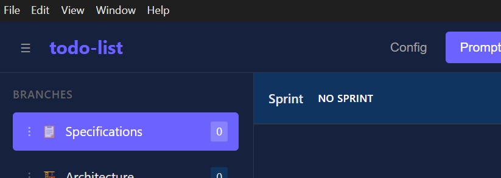</a>

Fill in the project settings:

| Setting | Value |
|---------|-------|
| Programming Style | Hybrid (OOP + FP) |
| Testing Approach | Behavior-Driven Development |
| Documentation Level | Standard |
| Error Handling | Exceptions |
| Naming Convention | camelCase |
| Comment Style | JSDoc |

<a href="screenshots/screenshots/config-settings-filled.png">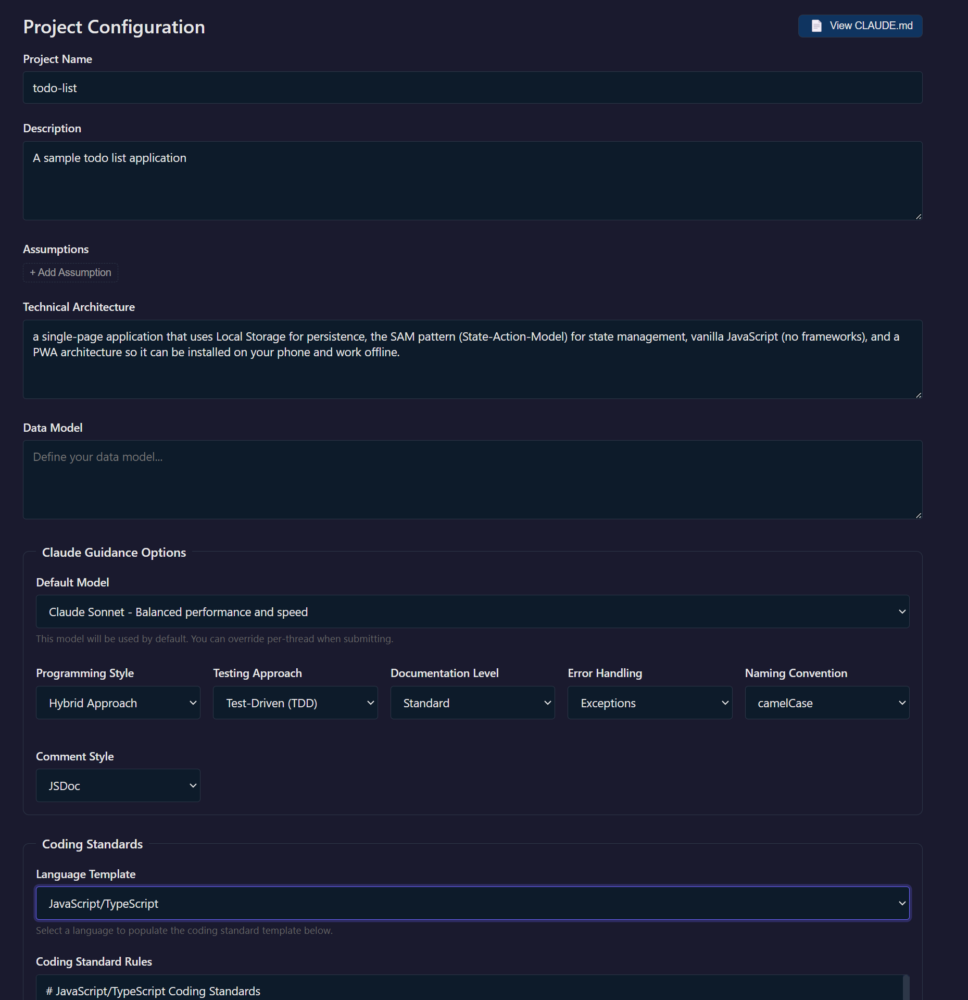</a>

Click **"Save Configuration"** then click **"Generate Claude.md"** to create the project context file that Claude will read.

<a href="screenshots/config-save-generate-buttons.png">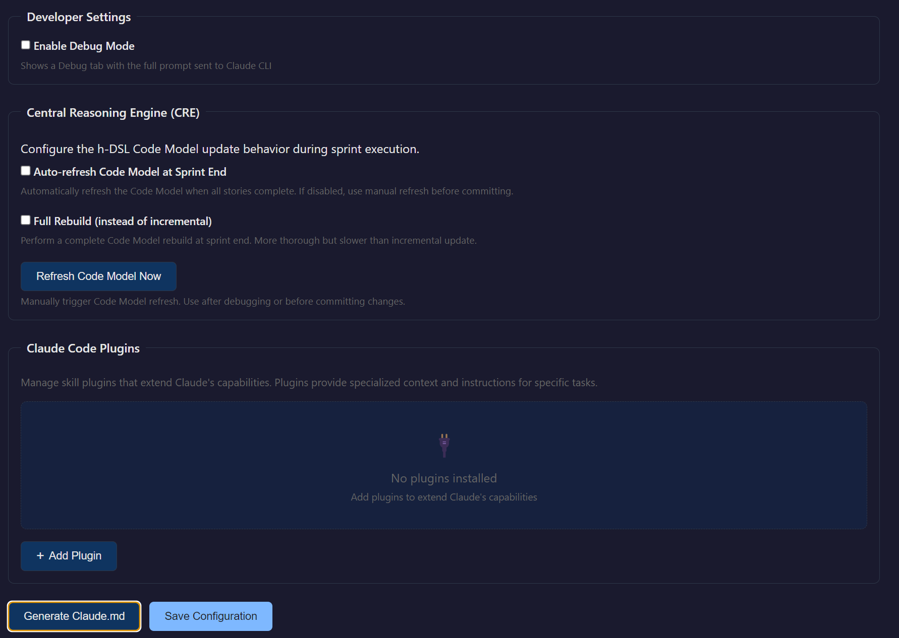</a>

---

## Path A: Specification-First

This path uses the **Document Editor** plugin to create a detailed functional specification, then feeds that spec into the Prompt view to derive user stories and run automated sprints.

---

### A.1 — Create a New Document

Open the **Document Editor** plugin from the navigation bar.

<a href="screenshots/editor-tab-nav.png">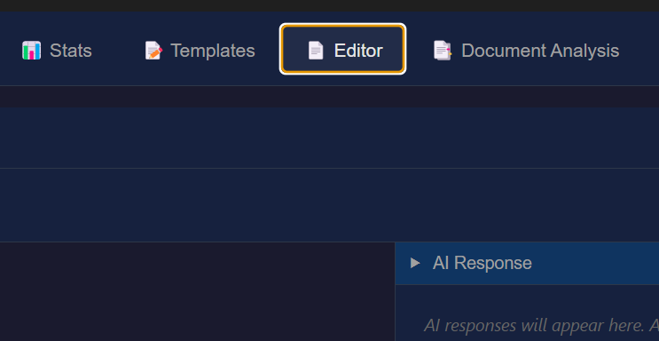</a>

Click **"New"** and enter:
- **Filename:** `todo-pwa-spec.md`
Note: on windows, make sure that you select all files, otherwise it will create a .txt document

<a href="screenshots/new-document-dialog.png">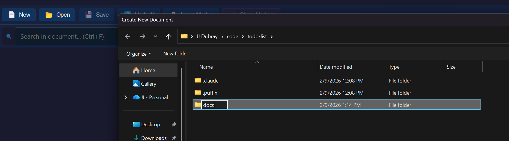</a>

---

### A.2 — Generate the Specification

In the document editor, paste the following text and submit it. The `/@puffin: ... @/` marker tells Claude to generate content directly into the document.

```
/@puffin:

Write a complete functional specification and detailed design for a Todo PWA with the following requirements:

PROJECT OVERVIEW:
A single-page application for managing a todo list. The app uses browser Local Storage for persistence (no backend server), vanilla JavaScript with the SAM pattern (State-Action-Model) for state management, and is built as a Progressive Web App so it can be installed on a phone and work offline.

FUNCTIONAL REQUIREMENTS:
- Add a new todo (text input + submit)
- Display the list of todos
- Mark a todo as complete (toggle)
- Delete a todo
- Edit a todo title inline
- Filter todos: All, Active, Completed
- Show count of remaining active todos
- Clear all completed todos with one click
- All data persists in Local Storage across page reloads

TECHNICAL REQUIREMENTS:
- Vanilla JavaScript, HTML, and CSS only (no frameworks, no npm, no build tools)
- SAM pattern (State-Action-Model) for state management:
  - Model: holds the todo list state and enforces business rules
  - Actions: pure functions that propose state changes (addTodo, toggleTodo, deleteTodo, etc.)
  - State representation: renders the current model state to the DOM
- Single-page application (one index.html file with app.js and styles.css)
- Responsive, mobile-first design
- Progressive Web App:
  - manifest.json for installability
  - service-worker.js with cache-first strategy for offline support
- Accessible: ARIA labels, keyboard navigation, semantic HTML

DOCUMENT STRUCTURE:
1. Overview
2. Functional Requirements (as user stories with acceptance criteria)
3. Data Model (Local Storage schema, todo object structure)
4. SAM Architecture (Model, Actions, State representation — how they wire together)
5. UI Layout (describe each section: header, input area, todo list, filters, footer)
6. Technical Architecture (file structure, module responsibilities)
7. PWA Configuration (manifest fields, service worker caching strategy, offline behavior)
8. Acceptance Criteria Summary

Do not ask any questions. Generate the complete specification ready for implementation.

@/
```

Click on the "Process Markers" button on the lower right end of the window.

<a href="screenshots/editor-puffin-marker-before-submit.png">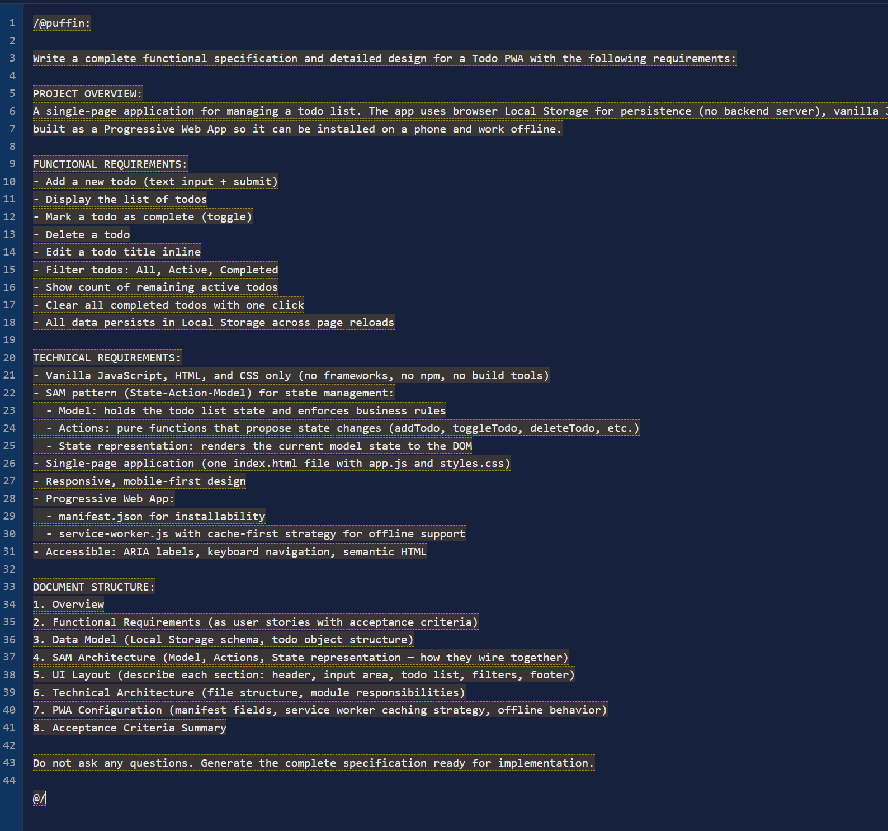</a>

Wait for Claude to generate the specification. This takes 2-5 minutes.

<a href="screenshots/editor-generated-spec-top.png">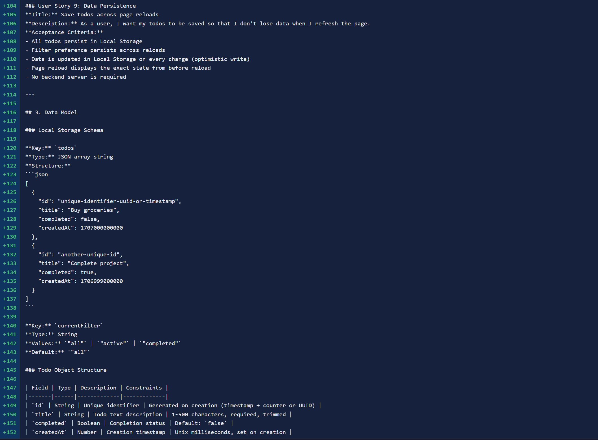</a>

---

### A.3 — Review the Specification

Read through the generated document. You can edit it if you want to change any requirements before implementation. The spec should contain:

- User stories with acceptance criteria
- A data model describing the todo object
- SAM architecture breakdown (Model, Actions, State representation)
- UI layout description
- File structure (index.html, app.js, styles.css, manifest.json, service-worker.js)
- PWA caching strategy

<a href="screenshots/editor-generated-spec-sam-section.png">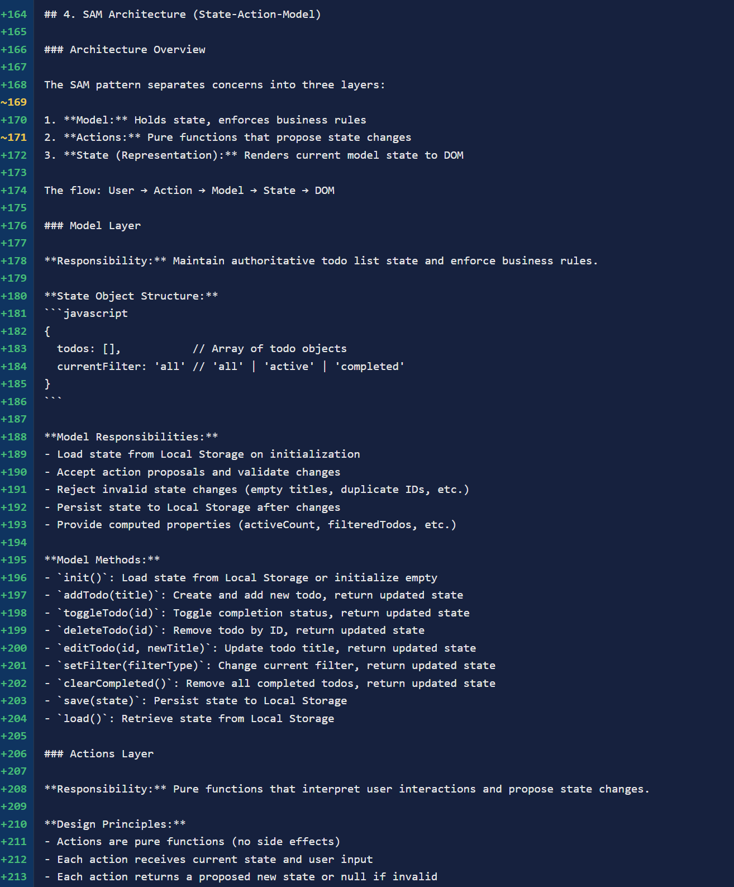</a>

---

### A.4 — Attach the Spec and Derive User Stories

Switch to the **Prompt** view by clicking the chat tab in the navigation bar.

<a href="screenshots/prompt-tab-nav.png">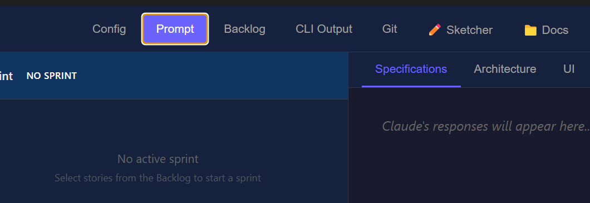</a>

The Prompt view has three panels:

- Sprint Context
  - Sprint status  
  - User Story cards    
  - Sprint actions 
- Conversation  
  - Response area
  - Prompt textarea
  - Prompt controls
- Metadata
  - Thread stats

<a href="screenshots/prompt-view-three-panels.png">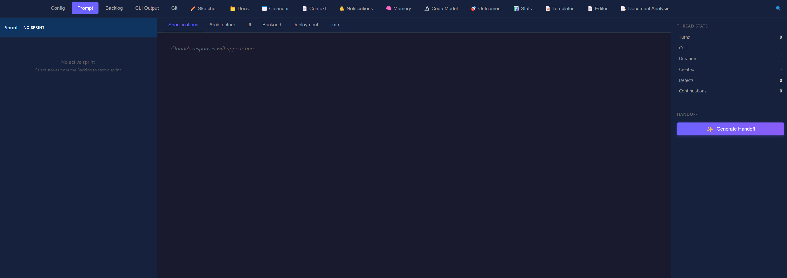</a>

#### Understanding the Prompt Controls

Below the prompt textarea, you'll find the **Prompt Controls** area. This section can be confusing at first, so here's what each element does:

<a href="screenshots/prompt-controls-annotated.png">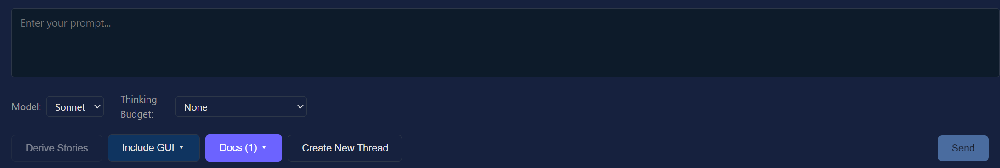</a>

**Options:**

| Control | What It Does |
|---------|-------------|
| **Model** dropdown | Select which Claude model to use (Opus, Sonnet, Haiku) |
| **Thinking Budget** dropdown | Control how much "thinking" Claude does before responding (None, Think 25%, Think Hard 50%, Think Harder 75%, Superthink 100%) |

**Actions**

| Button | What It Does |
|--------|-------------|
| **Derive Stories** | Extracts user stories from the current conversation context. Only enabled after you have at least one conversation exchange. |
| **Create New Thread** | Clears the conversation and starts a fresh thread in the current branch |
| **Cancel** | Stops a running Claude request (appears during processing) |
| **Send** | Submits your prompt to Claude |
| **Include GUI** | Dropdown to attach GUI designs (from the Designer plugin) to your prompt |
| **Include Docs** | Dropdown to attach design documents (from the docs/ directory) to your prompt |

#### Attach the Specification Document

1. Click the **"Include Docs"** dropdown
2. Select `todo-pwa-spec` from the list — this attaches your specification to the next prompt

<a href="screenshots/include-docs-dropdown-open.png">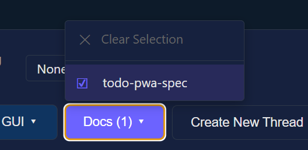</a>

3. Type the following prompt in the textarea:

```
Based on the attached specification, please create user stories for this Todo PWA project. Group them into sprints of 3-4 stories each. Prioritize: first core CRUD and display, then persistence and filtering, then PWA features.
```

4. Click **Send**

<a href="screenshots/prompt-with-spec-attached-ready.png">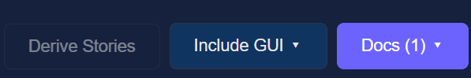</a>

Claude will respond with the user stories in the conversation area. Now you need to extract them into Puffin's backlog.

---

### A.5 — Derive User Stories into Backlog

After Claude responds with the user stories in the conversation, click the **"Derive Stories"** button in the prompt controls.

<a href="screenshots/derive-stories-button-enabled.png">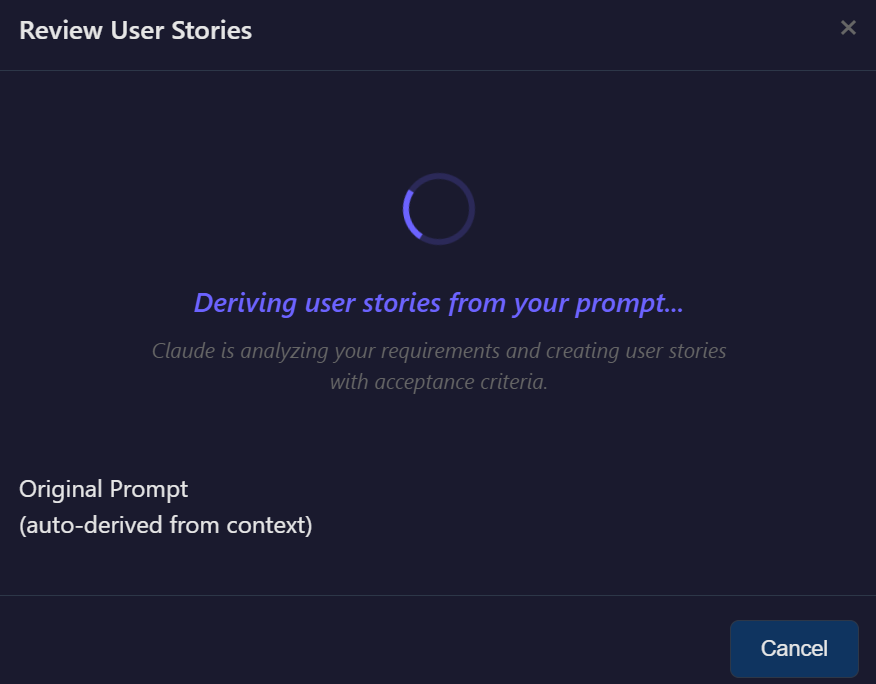</a>

Puffin extracts the stories from the conversation context, you need to mark them ready or request changes and then add them to the **Backlog**.

<a href="screenshots/user_stories.png">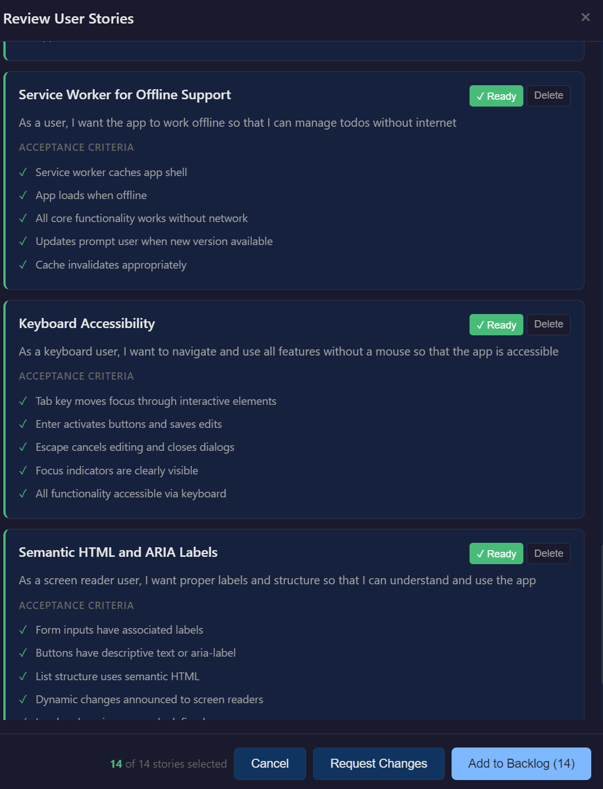</a>

---

### A.6 — Review User Stories

Switch to the **Backlog** view by clicking the backlog tab in the navigation bar.

<a href="screenshots/backlog-tab-nav.png">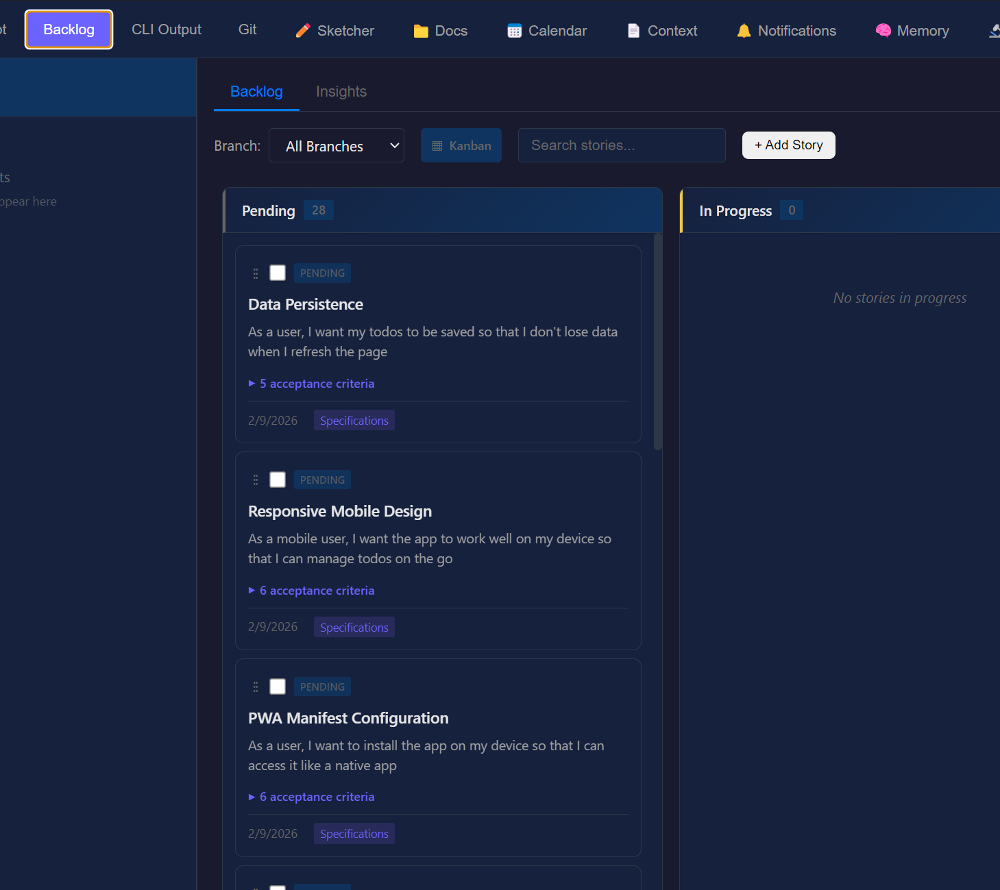</a>

You should see the derived user stories listed. Each story has:
- A title
- A description ("As a user, I want... so that...")
- Acceptance criteria

<a href="screenshots/backlog-story-list.png">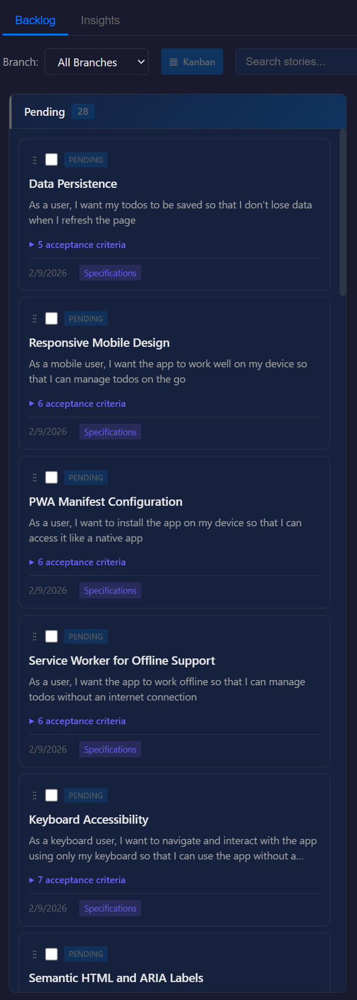</a>

Click on a story to expand its details. You can edit any story by clicking on it.

<a href="screenshots/backlog-story-expanded.png">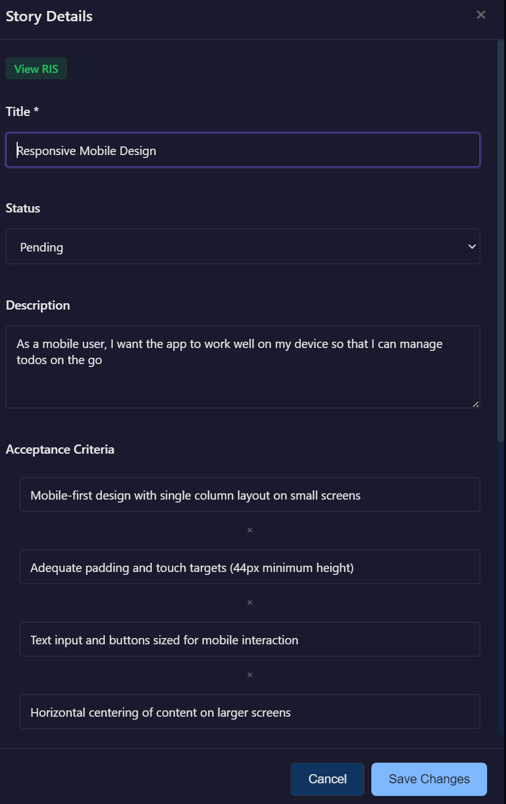</a>

---

### A.7 — Create a Sprint

1. Select 3-4 stories for the first sprint (check the boxes next to the story titles)
2. Click **"Create Sprint"**

<a href="screenshots/backlog-stories-selected-create-sprint.png">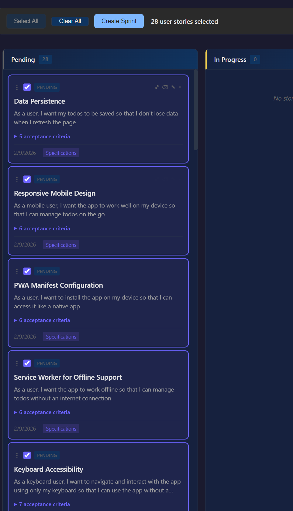</a>


---

### A.8 — Run the Automated Sprint

1. Puffin navigates to the Prompt view where the execution of the sprint will take place
2. The **Sprint Context** with your stories

<a href="screenshots/sprint-context-stories-loaded.png">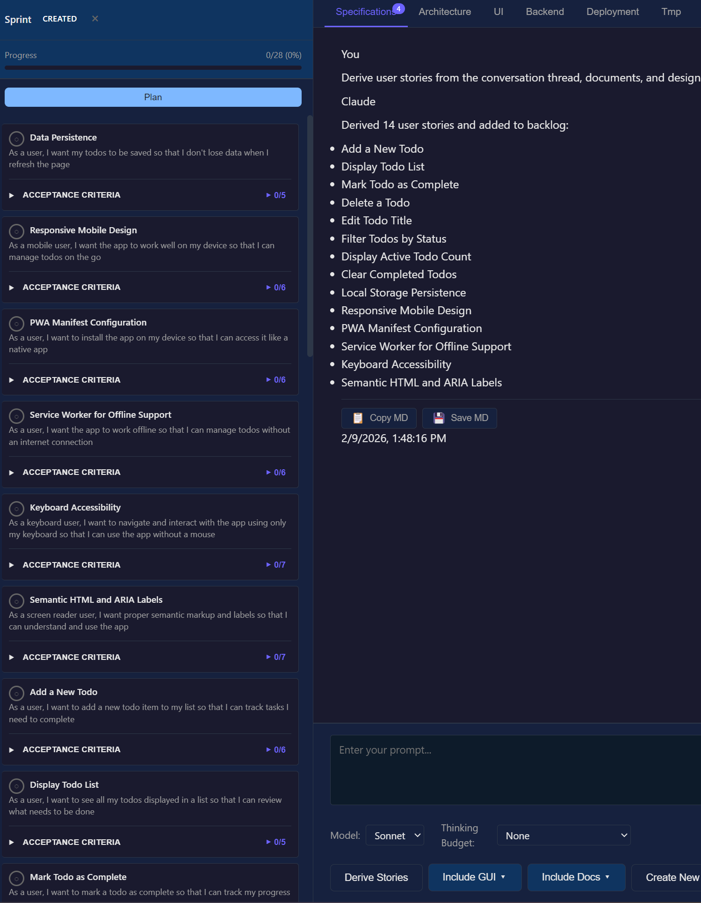</a>

3. Click **"Plan"** to generate an implementation plan

<a href="screenshots/sprint-plan-button.png">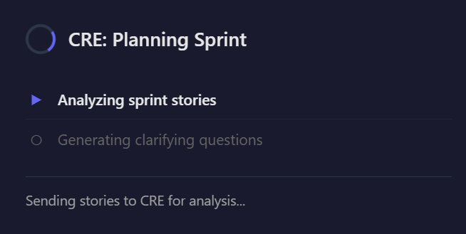</a>

Puffin may ask you some questions to clarify the requirements.

<a href="screenshots/plan-questions.png">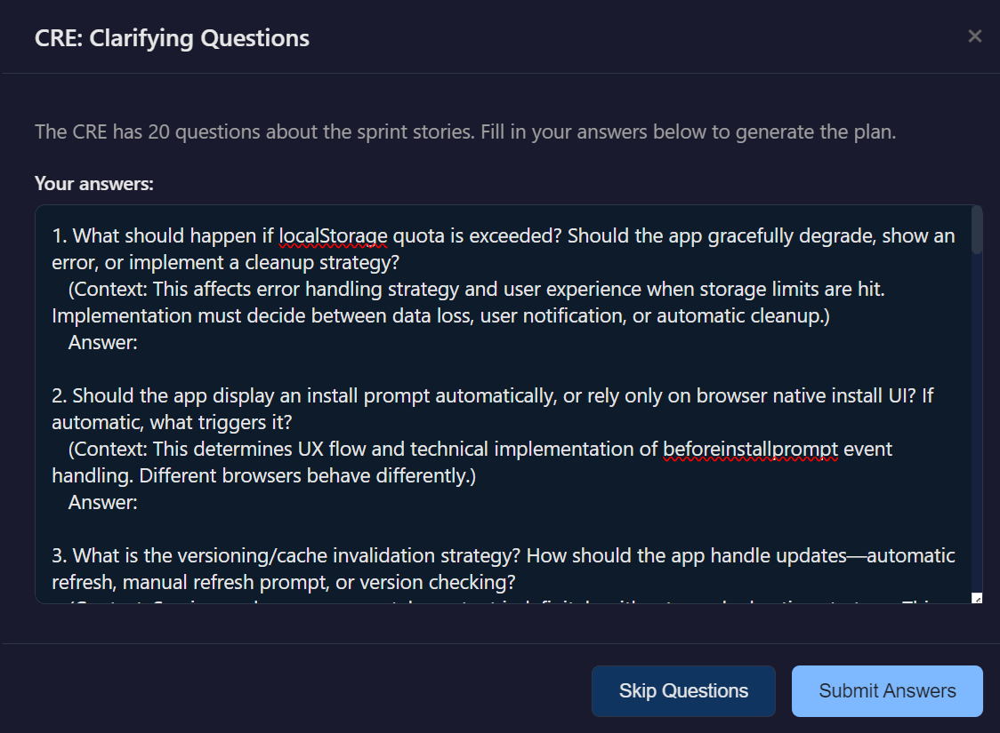</a>

4. Review the generated plan, then click **"Approve Plan"**

<a href="screenshots/sprint-plan-approve.png">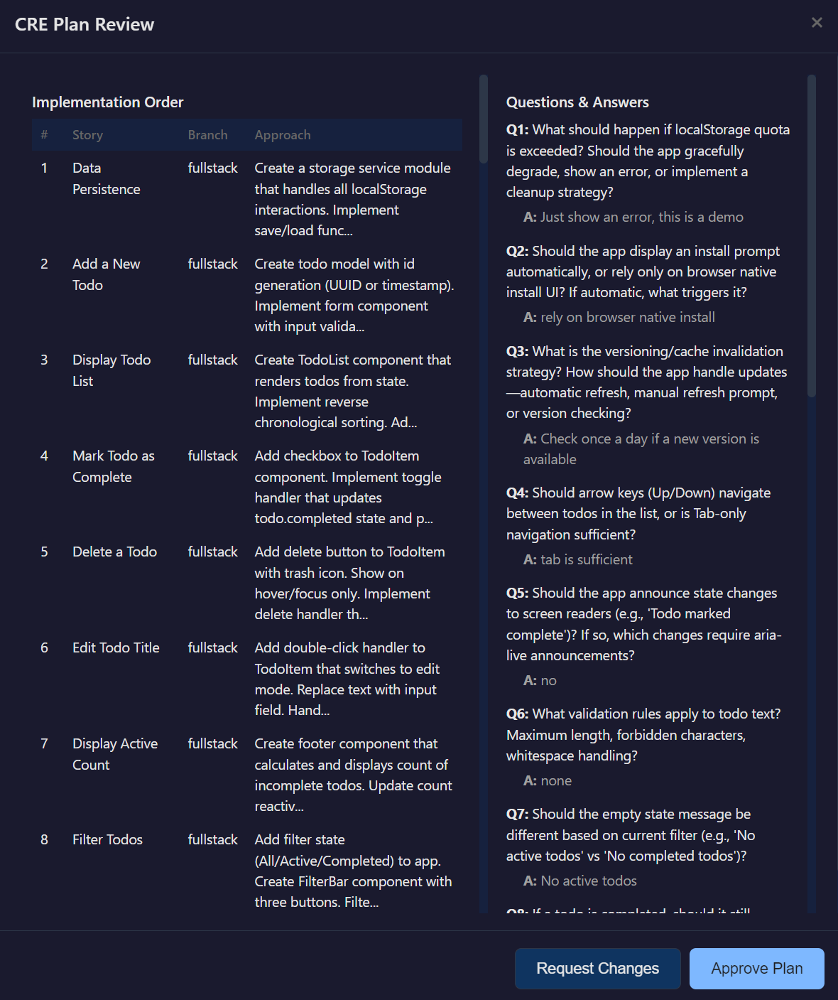</a>

5. Puffin begins implementing each story automatically. Watch progress in the Sprint Context panel:
   - Stories move through statuses: **Pending** → **In Progress** → **Completed**
   - The progress bar fills as stories complete
   - Claude creates and edits files autonomously

<a href="screenshots/sprint-execution-mid-progress.png">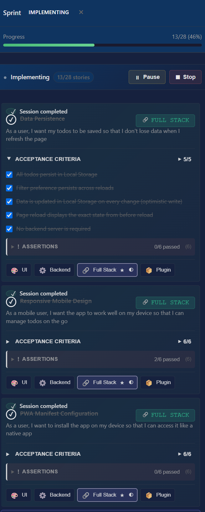</a>

6. Monitor the CLI output for detailed implementation steps

<a href="screenshots/cli-output-sprint-execution.png">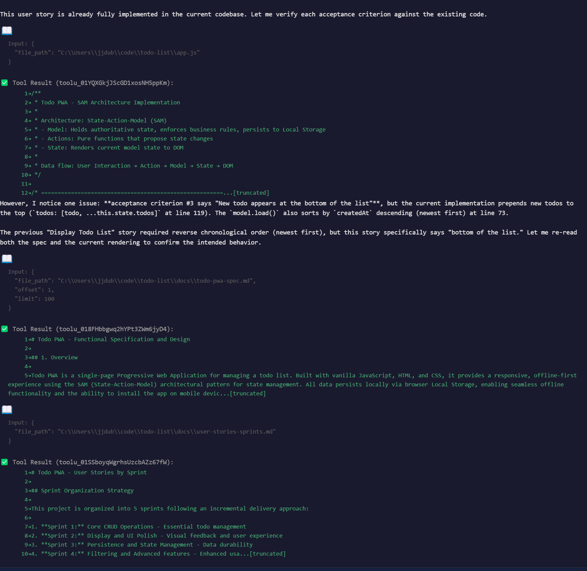</a>

---

### A.9 — Review and Test

Once all stories in the sprint show **Completed**:

1. Check the **Git** view to see what files were created

<a href="screenshots/git-view-sprint-files.png">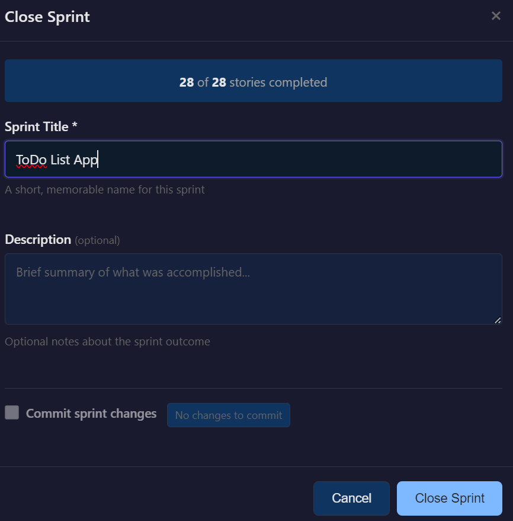</a>

2. Open a terminal in your project directory and start a local server:

```bash
python -m http.server 8080
```

3. Open `http://localhost:8080` in your browser and test:
   - Add a todo
   - Mark it complete
   - Delete it
   - Reload the page — todos should persist

<a href="screenshots/browser-todo-pwa-running.png">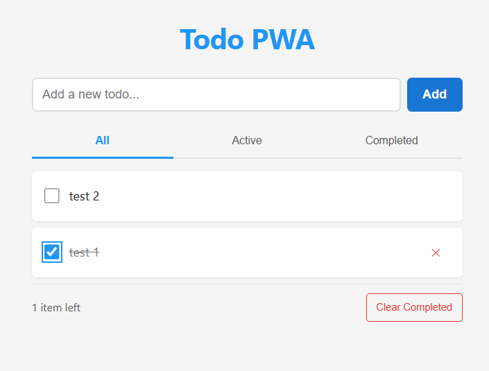</a>

---

### A.10 — Run Additional Sprints

Repeat steps A.7 through A.9 for the remaining stories:

- **Sprint 2**: Filtering (All/Active/Completed), clear completed, todo count
- **Sprint 3**: PWA setup (manifest.json, service-worker.js, offline support)

After Sprint 3, test PWA features:

- **Offline**: Open DevTools → Network → check "Offline" → reload. The app should still work.
- **Install**: In Chrome, click the browser menu → "Install app". The todo app appears as a standalone app on your device.

<a href="screenshots/browser-offline-test.png">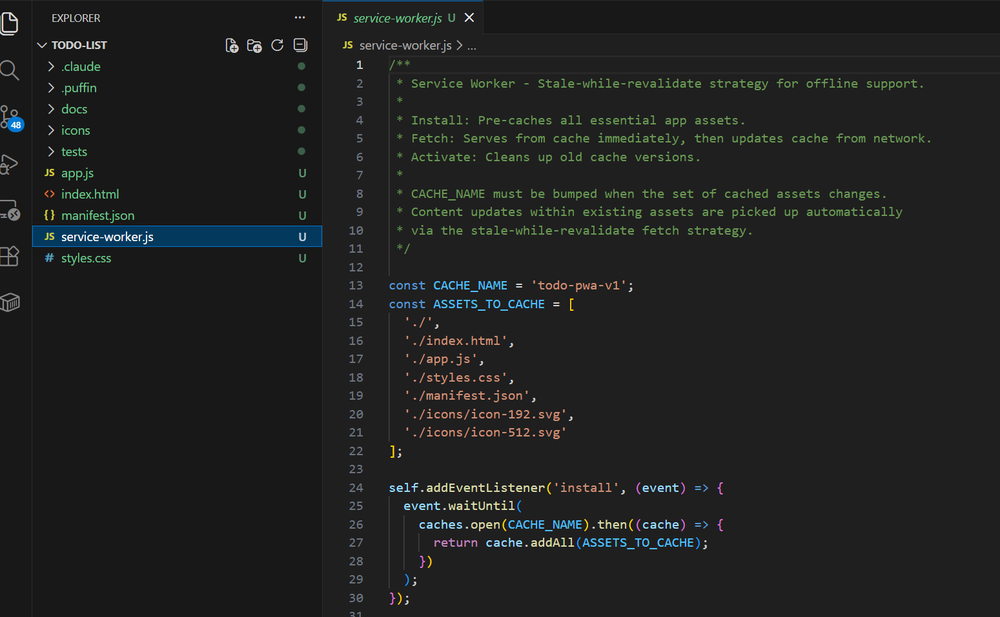</a>


---

## Path B: Direct Prompting

This path skips the specification document and works directly in the Prompt view. Claude will ask clarifying questions, you'll answer them, and Claude will build the project iteratively.

No user stories or sprints are used in this path.

---

### B.1 — Open the Prompt View

Click the **Prompt** view tab in the navigation bar.

<a href="screenshots/prompt-view-empty-state.png">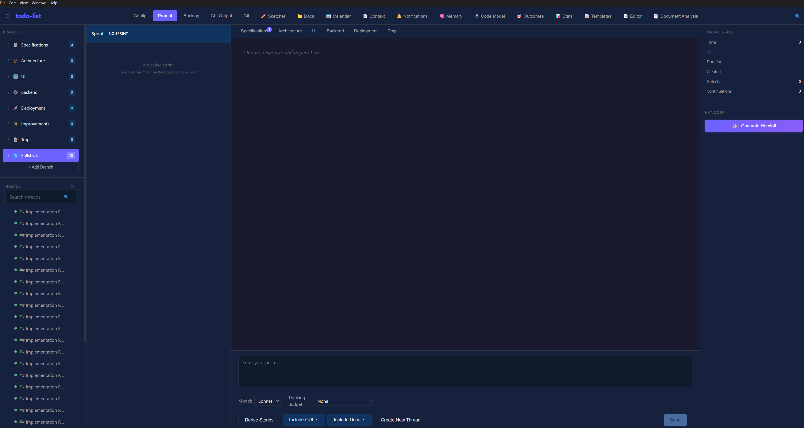</a>

Before submitting, configure the prompt controls:
- **Model**: Opus (or Sonnet for faster responses)
- **Thinking Budget**: None (or Think 25% for more deliberate responses)

<a href="screenshots/prompt-controls-model-thinking.png">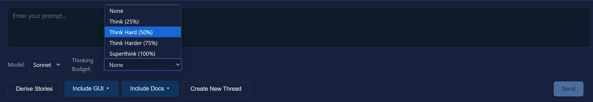</a>

---

### B.2 — First Prompt

Type the following in the prompt textarea and click **Send**:

```
  Add Calendar View with Completed Todos Per Day

  Context

  This is a vanilla JavaScript PWA todo app using the SAM (State-Action-Model) architecture. All state lives in model.state.todos, persisted to Local Storage. Each todo currently
  has: id, title, completed (boolean), and createdAt (timestamp). The data flow is: User Interaction → Action → Model → State → DOM.

  Prerequisite: Track Completion Date

  Todos currently have no completedAt timestamp. Before building the calendar:

  1. Add a completedAt property to the todo schema (null when active, Date.now() when completed)
  2. Update model.toggleTodo() to set completedAt = Date.now() when marking complete, and completedAt = null when uncompleting
  3. Migrate existing data on model.load() — any todo with completed: true but no completedAt should be backfilled with its createdAt value as a reasonable fallback

  Feature: Calendar View

  Add a monthly calendar UI between the filter tabs and the todo list in index.html. Requirements:

  Calendar Display
  - Show a month grid (Sun–Sat) for the currently viewed month
  - Include navigation arrows to move between months and a header showing "Month Year"
  - Each day cell displays the day number and a small badge showing the count of todos completed on that day (hide the badge if count is 0)
  - The current day should have a visual indicator (e.g. subtle border or background)

  Interaction
  - Clicking a day selects it (highlighted state) and filters the todo list below to show only todos completed on that day
  - Clicking the already-selected day deselects it and returns to the current filter view (All/Active/Completed)
  - The existing filter tabs (All/Active/Completed) should continue to work — selecting a calendar day temporarily overrides them, and clicking a filter tab clears the calendar
  selection

  SAM Architecture Integration
  - Model: Add selectedDate (ISO date string or null) and calendarMonth/calendarYear to model.state. Add methods: selectDate(dateString), clearSelectedDate(),
  navigateMonth(offset). Update getFilteredTodos() to respect selectedDate when set. Persist selectedDate is not necessary (transient UI state).
  - Actions: Add selectDate(dateString), clearSelectedDate(), navigateMonth(offset) actions that call the model and trigger renderState()
  - State/Rendering: Add renderCalendar() called from renderState(). Compute completion counts per day from model.state.todos by grouping on completedAt date. Update renderState()
  to call renderCalendar().

  Styling
  - The calendar should be responsive and match the existing design language (colors, fonts, spacing from styles.css)
  - Use CSS Grid for the calendar layout
  - Day cells with completions should have a subtle visual treatment (e.g., a small colored dot or badge)
  - Selected day should be clearly highlighted
  - Keep the calendar compact so it doesn't dominate the view

  Testing
  - Add tests in tests/tests.js covering:
    - completedAt is set/cleared on toggle
    - Migration of existing todos without completedAt
    - Completion count calculation per day
    - getFilteredTodos() returns correct results when selectedDate is set
    - Selecting/deselecting a date updates the filter correctly
    - Month navigation updates the calendar view
```

<a href="screenshots/prompt-first-message-typed.png">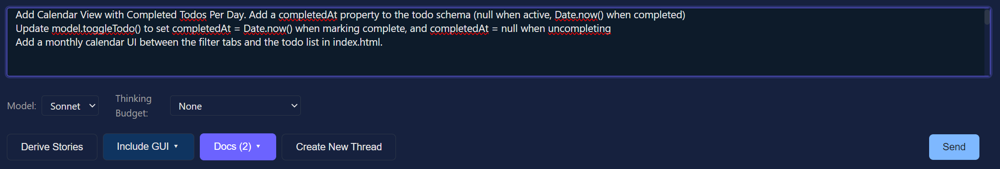</a>

---

### B.3 — Answer Claude's Questions

Claude mays ask questions. Here are example questions and suggested answers:

**Claude asks about UI style:**

```
Use a clean, minimal design. White background, subtle gray borders.
Primary action color: blue (#007AFF). Completed todos get
strikethrough text in gray. Center the app in a max-width container
(600px) for desktop, full-width on mobile.
```

**Claude asks about the data model:**

```
Keep it simple:
{
  id: string (use Date.now().toString()),
  title: string,
  completed: boolean,
  createdAt: number (timestamp)
}

Store as JSON array in Local Storage under key "todos".
```

**Claude asks about the service worker strategy:**

```
Cache-first for all static assets. Cache the HTML, CSS, JS,
and manifest on install. The app has no API calls — everything
is local. It should work 100% offline after first load.
```

---

### B.4 — Claude Builds the Feature

After the Q&A, Claude starts creating files. Watch the conversation for file creation messages and the **CLI Output** tab for details.

<a href="screenshots/conversation-claude-building.png">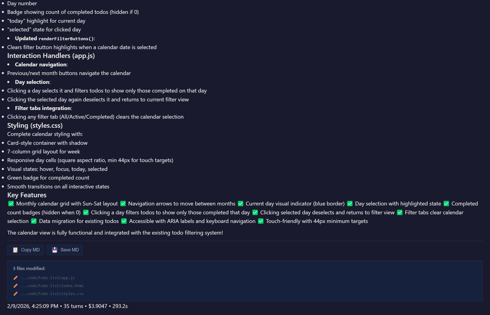</a>

<a href="screenshots/thinking.png">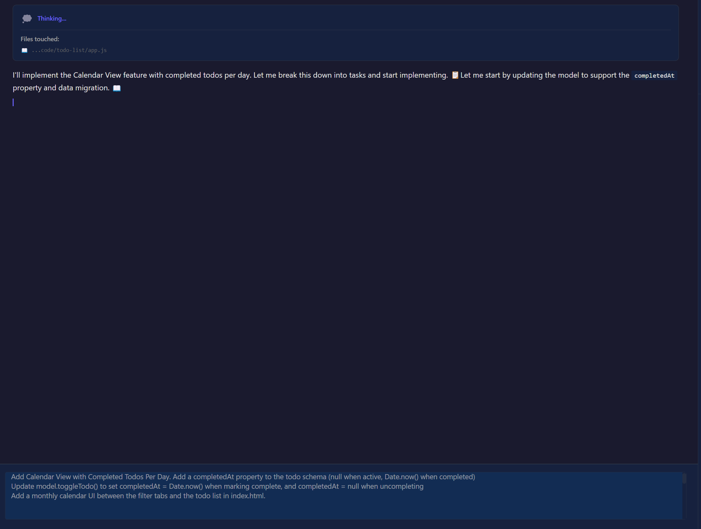</a>

If Claude's response gets cut off mid-implementation, submit a follow-up prompt:

```
Please continue where you left off.
```

---

### B.5 — Iterate and Refine

After the initial build, submit follow-up prompts to refine:

**Add missing features:**
```
The filter buttons aren't working. Can you fix the filter logic
and make sure clicking All/Active/Completed updates the displayed
list? Also add a "Clear Completed" button below the filters.
```

**Fix styling:**
```
The todo items are too close together. Add some padding and a
subtle bottom border between items. Also make the checkbox bigger
on mobile (at least 24px tap target).
```

**Add PWA support (if not done yet):**
```
Now add the PWA files:
1. manifest.json with app name "Todo PWA", theme color #007AFF,
   and a 192x192 icon placeholder
2. service-worker.js that caches index.html, app.js, styles.css,
   and manifest.json on install
3. Register the service worker in index.html
```

<a href="screenshots/conversation-refinement-exchange.png">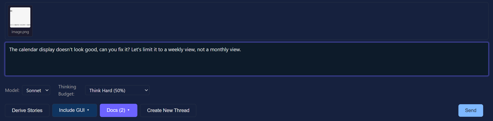</a>

---

### B.6 — Test the Application

Open a terminal in your project directory and start a server:

```bash
python -m http.server 8080
```

Open `http://localhost:8080` and test:

- Add several todos
- Mark some complete, delete others
- Use the filters (All / Active / Completed)
- Reload the page — todos should still be there
- Open DevTools → Network → check "Offline" → reload — app should still work
- In Chrome, click menu → "Install app" to install as PWA

<a href="screenshots/browser-todo-pwa-complete.png">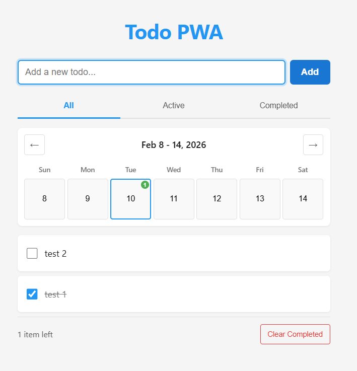</a>

---

## What's Next

Now that you've built your first project, explore other Puffin features as you work on more complex projects:

- **Branch tabs** in the Prompt view to organize work by concern (Specifications, Architecture, UI, Backend)
- **Include GUI** to attach wireframe designs to your prompts
- **Include Docs** to attach any document from your docs/ directory
- **Sprint code review** to verify implementations against acceptance criteria
- **Git view** to track all changes Claude makes
